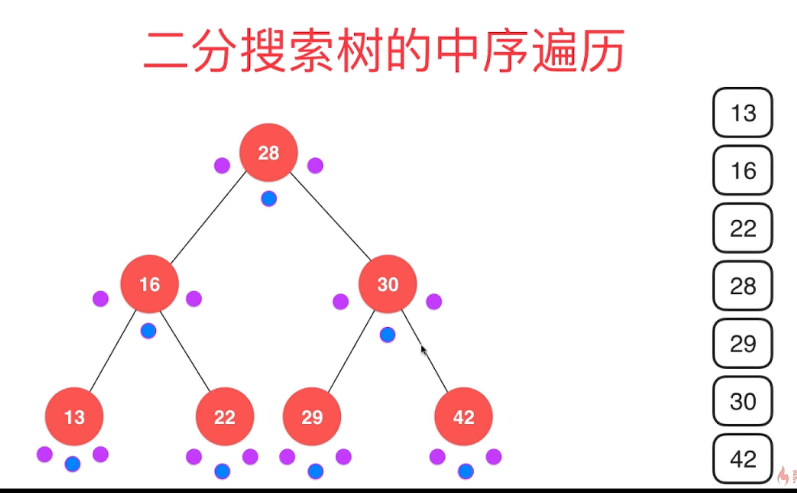

树结构

使用树结构存储数据，出奇的高效

二分搜索树

平衡二叉树： AVL,红黑树

堆，并查集

线段树，Tire(字典树，前缀树木)


# 二分搜索树

```java
//二分搜索树元素必须是可比较的
public class BST<E extends Comparable<E>> {

    private class Node{
        public E e;
        public Node left,right;

        public Node(E e) {
            this.e = e;
            left = null;
            right = null;
        }
    }

    private Node root;
    private int size;
    public BST() {
        root = null;
        size = 0;
    }

    public int size() {
        return size;
    }

    public boolean isEmpty() {
        return size == 0;
    }

    public void add(E e) {
        /*if(root == null) {
            root = new Node(e);
            size++;
        } else {
            add(root,e);
        }*/
        root = add(root,e);
    }

    //向以Node为根的二分搜索树中插入元素E，递归算法
    /*private void add(Node node,E e) {
        if(e.equals(node.e)) {
            return;
        } else if(e.compareTo(node.e) < 0 && node.left == null) {
            node.left = new Node(e);
            size++;
            return;
        } else if(e.compareTo(node.e) > 0 && node.right == null) {
            node.right = new Node(e);
            size++;
            return;
        }

        if(e.compareTo(node.e) < 0) {
            add(node.left,e);
        } else { //e.compareTo(node.e) > 0
            add(node.right,e);
        }
    }*/
	
    //改进后的代码
    private Node add(Node node,E e) {
        if(node == null) {
            size++;
            return new Node(e);
        }

        if(e.compareTo(node.e) < 0) {
            node.left = add(node.left,e);
        } else if(e.compareTo(node.e) > 0) {
            node.right = add(node.right,e);
        }
        return node;
    }
}
```

判断是否存在 和 前序遍历，以及打印

```java
    public boolean contains(E e) {
        return contains(root,e);
    }
    
    //查找二分搜索树中是否有某种元素，利用递归查找
    private boolean contains(Node node, E e) {
        if (node == null) {
            return false;
        }
        if (e.compareTo(node.e) == 0) {
            return true;
        } else if (e.compareTo(node.e) < 0) {
            return contains(node.left, e);
        } else { //e.compareTo(node.e) > 0
            return contains(node.right, e);
        }
    }


    //前序遍历
    public void preOrder() {
        preOrder(root);
    }

    //以node为根节点，递归遍历所有节点
    private void preOrder(Node node) {
        if (node == null) {
            return;
        }
        System.out.println(node.e);
        preOrder(node.left);
        preOrder(node.right);
    }
	
    //前序遍历
    public void preOrder() {
        preOrder(root);
    }

    //以node为根节点，递归遍历所有节点
    private void preOrder(Node node) {
        if (node == null) {
            return;
        }
        System.out.println(node.e);
        preOrder(node.left);
        preOrder(node.right);
    }


    //中序遍历  中序遍历是有顺序的
    public void inOrder() {
        inOrder(root);
    }

    private void inOrder(Node node) {
        if(node == null) {
            return;
        }
        inOrder(node.left);
        System.out.println(node.e);
        inOrder(node.right);
    }

    //后序遍历使用场景 为二分搜索树释放内存
    public void postOrder() {
        postOrder(root);
    }

    private void postOrder(Node node) {
        if(node == null) {
            return;
        }
        postOrder(node.left);
        postOrder(node.right);
        System.out.println(node.e);
    }

    @Override
    public String toString() {
        StringBuilder res = new StringBuilder();
        generatesBSTString(root, 0, res);
        return res.toString();
    }

    //生成以node为根节点，深度为depth的描述二叉树的字符串
    private void generatesBSTString(Node node, int depth, StringBuilder res) {
        if (node == null) {
            res.append(generateDepthString(depth) + "null\n");
            return;
        }
        res.append(generateDepthString(depth) + node.e + "\n");
        generatesBSTString(node.left, depth + 1, res);
        generatesBSTString(node.right, depth + 1, res);
    }

    private String generateDepthString(int depth) {
        StringBuilder res = new StringBuilder();
        for (int i = 0; i < depth; i++) {
            res.append("--");
        }
        return res.toString();
    }
```

测试用例，前序遍历

```java
public class Test {
    public static void main(String[] args) {
        BST<Integer> bst = new BST<>();

        int[] arr = {5,4,6,7,8,3};


        /////////////////
        //      5      //
        //     / /     //
        //    4   6    //
        //    /   /
        //   3    7  8  //
        //  //     //  //

        for(int a: arr) {
            bst.add(a);
        }

        bst.preOrder();
        System.out.println(bst);
    }
```



三个小圆点来判断前中后

前序遍历 第一个小圆点变量 就取值

中序遍历 第二个小圆点变量 就取值

后序遍历 第三个小圆点变量 就取值


**非递归实现前序遍历**

```java
//前序遍历非递归实现
//非递归就是自己模拟系统栈，所以要用栈这种数据结构
public void preOrderNR() {
    Stack<Node> stack = new Stack<>();
    stack.push(root);
    while (!stack.isEmpty()) {
        Node cur = stack.pop();
        System.out.println(cur.e);
        if (cur.right != null)
            stack.push(cur.right);
        if (cur.left != null)
            stack.push(cur.left);
    }
}
```

二分搜索树的前序遍历 就是 $\textcolor{Red}{深度优先遍历} $   ，其实中序，后序也是深度

税友面试失分题，深度优先遍历应该借助栈这种数据结构

层序遍历就是 $\textcolor{Red}{广度优先遍历} $   需要借助队列这种数据结构

```java
    //层序遍历，也就是广度优先遍历
    //要借助队列这一数据结构
    public void levelOrder() {
        Queue<Node> queue = new LinkedList<>();
        queue.add(root);
        while (!queue.isEmpty()) {
            Node cur = queue.remove();
            System.out.println(cur.e);
            if(cur.left !=null)
                queue.add(cur.left);
            if(cur.right !=null)
                queue.add(cur.right);
        }
    }
```

二分搜索树的最小值 和 最大值

并且删除掉最小元素，当它有右节点时，需要把上一左节点删掉并拼接回右子树

```java

    //找出二分搜索树的最小值，思路，右子树一路走到底
    public E minimum() {
        if(size == 0) {
            throw new IllegalArgumentException("bst is empty");
        }
        return minimum(root).e;
    }

    private Node minimum(Node node) {
        if(node.left == null) {
            return node;
        }
        return minimum(node.left);
    }


    //找出二分搜索树的最大值，思路，左子树一路走到底
    public E maximum() {
        if(size == 0) {
            throw new IllegalArgumentException("bst is empty");
        }
        return maximum(root).e;
    }

    private Node maximum(Node node) {
        if(node.right == null) {
            return node;
        }
        return maximum(node.right);
    }

    //从二分搜索树中删除最小值所在节点，返回最小值
    public E removeMin() {
        E ret = minimum();
        root = removeMin(root);
        return ret;
    }
	**********这段比较难理解*********************************
    //删除掉以node为根的二分搜索树的最小节点
    //返回删除节点后新的二分搜索树的根
    private Node removeMin(Node node) {
        if(node.left == null) {
            Node rightNode = node.right;
            node.right = null;
            size--;
            return rightNode;
        }
        //删除左子树对应的最小值，并且返回回去
        node.left = removeMin(node.left);
        return node;
    }
    **********要多看看*********************************

    //从二分搜索树中删除最大值所在节点，返回最大值
    public E removeMax() {
        E ret = maximum();
        root = removeMax(root);
        return ret;
    }

    //删除掉以node为根的二分搜索树的最小节点
    //返回删除节点后新的二分搜索树的根
    private Node removeMax(Node node) {
        if(node.right == null) {
            Node leftNode = node.left;
            node.left = null;
            size--;
            return leftNode;
        }
        //删除右子树对应的最小值，并且返回回去
        node.right = removeMin(node.right);
        return node;
    }
```

测试用例

```java
public class Test2 {
    public static void main(String[] args) {
        BST<Integer> bst = new BST<>();
        Random random = new Random();
        for (int i = 0; i < 1000; i++) {
            bst.add(random.nextInt(10000));
        }

        List<Integer> nums = new ArrayList<>();
        while (bst.size() != 0)
            nums.add(bst.removeMin());
        System.out.println(nums);
        for (int i = 0; i < nums.size() - 1; i++) {
            if (nums.get(i) > nums.get(i + 1)) {
                throw new IllegalArgumentException("testerror");
            }
        }
        System.out.println("test pass");
    }
}
```


**删除任意元素**

当要删除的元素 左右都有孩子时，找到这个元素的比它大（或者小），但差值最小的元素，

改元素替换要删除的元素，同时左节点是删除的原来左节点，右节点是最小值


```java
//从二分搜索树中删除最大值所在节点，返回最大值
    public E removeMax() {
        E ret = maximum();
        root = removeMax(root);
        return ret;
    }

    //删除掉以node为根的二分搜索树的最小节点
    //返回删除节点后新的二分搜索树的根
    private Node removeMax(Node node) {
        if (node.right == null) {
            Node leftNode = node.left;
            node.left = null;
            size--;
            return leftNode;
        }
        //删除右子树对应的最小值，并且返回回去
        node.right = removeMin(node.right);
        return node;
    }

    //删除节点 e
    public void remove(E e) {
        root = remove(root, e);
    }

    //删除该节点并返回删除后的根节点
    private Node remove(Node node, E e) {
        if (node == null) {
            return null;
        }

        if (e.compareTo(node.e) < 0) {
            node.left = remove(node.left, e);
            return node;
        } else if (e.compareTo(node.e) > 0) {
            node.right = remove(node.right, e);
            return node;
        } else { // e == node.e
            //删除右节点为空的情况
            if (node.right == null) {
                Node leftNode = node.left;
                node.left = null;
                size--;
                return leftNode;
            }
            //删除左节点为空的情况
            if (node.left == null) {
                Node rightNode = node.right;
                node.right = null;
                size--;
                return rightNode;
            }
            //删除左右节点都不为空的情况
            //找到比删除节点大的最小节点
            //用这个节点顶替待删除节点的位置
            Node successor = minimum(node.left);
            successor.left = node.left;
            //右节点是删除点successor的整根树，而不是某个节点
            //这样便于理解，否则会陷入右节点是自己的思维陷阱
            //removeMin返回是一棵树而不是一个节点
            successor.right = removeMin(node.left);
            node.left = node.right = null;
            return successor;
        }
    }

```


感悟是 递归中 return 就是拼接的步骤，递归真是思维的难点啊


leetcode真题，可以在原来的之上再加个方法，求最大深度

```java
    //二分搜索树的最大深度 来自leetcode真题
    public int maxDepth() {
        int depth = maxDepth(root);
        return depth;
    }

    private int maxDepth(Node node) {
        if(node == null) {
            return 0;
        }
        return Math.max(maxDepth(node.left),maxDepth(node.right))+1;
    }
```


# 集合

## 基于二分搜索树

```java
public interface Set<E extends Comparable>  {

    void add(E e);

    void remove(E e);

    boolean contains(E e);

    int getSize();

    boolean isEmpty();

}

```

```java
public class BSTSet<E extends Comparable<E>> implements Set<E> {

    private BST<E> bst;

    public BSTSet() {
        bst = new BST<>();
    }

    @Override
    public void add(E e) {
        bst.add(e);
    }

    @Override
    public void remove(E e) {
        bst.remove(e);
    }

    @Override
    public boolean contains(E e) {
        return bst.contains(e);
    }

    @Override
    public int getSize() {
        return bst.size();
    }

    @Override
    public boolean isEmpty() {
        return bst.isEmpty();
    }
}
```

测试用例

```java
import java.io.FileInputStream;
import java.util.ArrayList;
import java.util.Scanner;
import java.util.Locale;
import java.io.File;
import java.io.BufferedInputStream;
import java.io.IOException;

// 文件相关操作
public class FileOperation {

    // 读取文件名称为filename中的内容，并将其中包含的所有词语放进words中
    public static boolean readFile(String filename, ArrayList<String> words){

        if (filename == null || words == null){
            System.out.println("filename is null or words is null");
            return false;
        }

        // 文件读取
        Scanner scanner;

        try {
            File file = new File(filename);
            if(file.exists()){
                FileInputStream fis = new FileInputStream(file);
                scanner = new Scanner(new BufferedInputStream(fis), "UTF-8");
                scanner.useLocale(Locale.ENGLISH);
            }
            else
                return false;
        }
        catch(IOException ioe){
            System.out.println("Cannot open " + filename);
            return false;
        }

        // 简单分词
        // 这个分词方式相对简陋, 没有考虑很多文本处理中的特殊问题
        // 在这里只做demo展示用
        if (scanner.hasNextLine()) {

            String contents = scanner.useDelimiter("\\A").next();

            int start = firstCharacterIndex(contents, 0);
            for (int i = start + 1; i <= contents.length(); )
                if (i == contents.length() || !Character.isLetter(contents.charAt(i))) {
                    String word = contents.substring(start, i).toLowerCase();
                    words.add(word);
                    start = firstCharacterIndex(contents, i);
                    i = start + 1;
                } else
                    i++;
        }

        return true;
    }

    // 寻找字符串s中，从start的位置开始的第一个字母字符的位置
    private static int firstCharacterIndex(String s, int start){

        for( int i = start ; i < s.length() ; i ++ )
            if( Character.isLetter(s.charAt(i)) )
                return i;
        return s.length();
    }
}

```

```java
public class Test4 {
    public static void main(String[] args) {
		
        System.out.println("Pride and Prejudice");

        ArrayList<String> words1 = new ArrayList<>();
        //txt放src外面
        if(FileOperation.readFile("pride-and-prejudice.txt", words1)) {
            System.out.println("Total words: " + words1.size());

            BSTSet<String> set1 = new BSTSet<>();
            for (String word : words1)
                set1.add(word);
            System.out.println("Total different words: " + set1.getSize());
        }

        System.out.println();

    }
}

```

