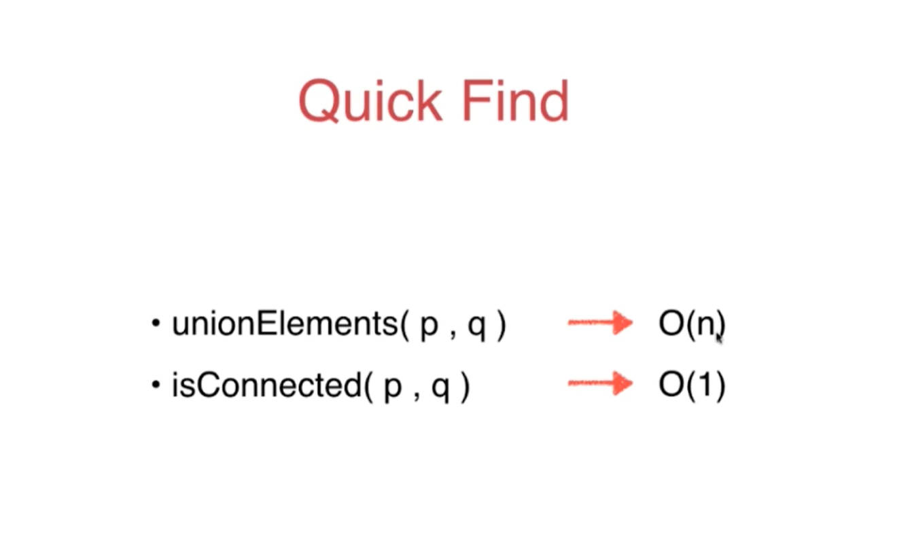

# 最大堆

## 定义

​	完全二叉树，每排节点是满的，且父节点大于等于子节点


可以用数组来表示 索引 公式如图所示

 完全二叉树可以用数组来表示

import 写好的 Array

```java
public class MaxHeap<E extends Comparable<E>> {

    private Array<E> data;

    public MaxHeap(int capacity) {
        data = new Array<>(capacity);
    }

    public MaxHeap() {
        data = new Array<>();
    }

    //返回堆中元素个数
    public int size() {
        return data.getSize();
    }

    //返回完全二叉树的数组表示中，一个索引所表示的元素的父亲节点的索引
    public boolean isEmpty() {
        return data.isEmpty();
    }

    //返回完全二叉树的数组表示中，一个索引所表示的元素的父亲节点的索引
    private int parent(int index) {
        if (index == 0) {
            throw new IllegalArgumentException("index-0 doesn't hava parent.");
        }
        return (index - 1) / 2;
    }

    //返回完全二叉树的数组表示中，一个索引所表示的元素的左孩子节点的索引
    private int leftChild(int index) {
        return index * 2 + 1;
    }

    //返回完全二叉树的数组表示中，一个索引所表示的元素的右孩子节点的索引
    private int rightChild(int index) {
        return index * 2 + 2;
    }


}
```

在Array中添加swap方法

```java
    public void swap(int i, int j) {
        if (i < 0 || i >= size || j < 0 || j >= size) {
            throw new IllegalArgumentException("index is error");
        }
        E t = data[i];
        data[i] = data[j];
        data[j] = t;
    }
```

## 添加和取出最大元素

```java
    //向堆中添加元素，sift up
    //添加的元素要和父亲节点比较，堆的性质是父亲节点大于等于子节点
    public void add(E e) {
        data.addLast(e);
        siftUp(data.getSize() - 1);
    }

    private void siftUp(int k) {
        //k所在元素和父亲元素做比较
        while (k > 0 && data.get(parent(k)).compareTo(data.get(k)) < 0) {
            data.swap(k, parent(k));
            k = parent(k);
        }
    }

    //看堆中的最大元素
    public E findMax() {
        if (data.getSize() == 0) {
            throw new IllegalArgumentException("heap is empty");
        }
        return data.get(0);
    }

    //取出堆中的最大元素
    public E extractMax() {
        E ret = findMax();
        data.swap(0, data.getSize() - 1);
        data.removeLast();
        siftDown(0);
        return ret;
    }

	private void siftDown(int k){

        while(leftChild(k) < data.getSize()){
            int j = leftChild(k); // 在此轮循环中,data[k]和data[j]交换位置
            if( j + 1 < data.getSize() &&
                    data.get(j + 1).compareTo(data.get(j)) > 0 )
                j ++;
            // data[j] 是 leftChild 和 rightChild 中的最大值

            if(data.get(k).compareTo(data.get(j)) >= 0 )
                break;

            data.swap(k, j);
            k = j;
        }
    }
```


## 单元测试

```java
public class Main {

    public static void main(String[] args) {

        int n = 1000000;

        MaxHeap<Integer> maxHeap = new MaxHeap<>();
        Random random = new Random();
        for(int i = 0 ; i < n ; i ++)
            maxHeap.add(random.nextInt(Integer.MAX_VALUE));

        int[] arr = new int[n];
        for(int i = 0 ; i < n ; i ++)
            arr[i] = maxHeap.extractMax();

        for(int i = 1 ; i < n ; i ++)
            if(arr[i-1] < arr[i])
                throw new IllegalArgumentException("Error");

        System.out.println("Test MaxHeap completed.");
    }
}

```

时间复杂度分析， add 和 extractMax 都是 O(logN) 都是树的高度，因为是完全二叉树，所以永远不会退化成链表


## replace和heapify


```java
//取出堆中的最大元素，并且替换成元素e
public E replace(E e) {
    E ret = findMax();
    data.set(0, e);
    siftDown(0);
    return ret;
}
```

heapify：把任意数组转为最大堆

要从非叶子节点开始，一个个siftdown操作

Array中新增构造方法

```java
public Array(E[] arr){
    data = (E[])new Object[arr.length];
    for(int i = 0 ; i < arr.length ; i ++)
        data[i] = arr[i];
    size = arr.length;
}
```

```java
//heapify
public MaxHeap(E[] arr){
    data = new Array<>(arr);
    if(arr.length != 1){
        for(int i = parent(arr.length - 1) ; i >= 0 ; i --)
            siftDown(i);
    }
}
```


heapify的算法复杂度是O(n)      add则是O(NlogN)


## add和 heapfify的比较

```java
public class Main {

    private static double testHeap(Integer[] testData, boolean isHeapify){

        long startTime = System.nanoTime();

        MaxHeap<Integer> maxHeap;
        if(isHeapify)
            maxHeap = new MaxHeap<>(testData);
        else{
            maxHeap = new MaxHeap<>(testData.length);
            for(int num: testData)
                maxHeap.add(num);
        }

        int[] arr = new int[testData.length];
        for(int i = 0 ; i < testData.length ; i ++)
            arr[i] = maxHeap.extractMax();

        for(int i = 1 ; i < testData.length ; i ++)
            if(arr[i-1] < arr[i])
                throw new IllegalArgumentException("Error");
        System.out.println("Test MaxHeap completed.");

        long endTime = System.nanoTime();

        return (endTime - startTime) / 1000000000.0;
    }

    public static void main(String[] args) {

        int n = 1000000;

        Random random = new Random();
        Integer[] testData1 = new Integer[n];
        for(int i = 0 ; i < n ; i ++)
            testData1[i] = random.nextInt(Integer.MAX_VALUE);

        Integer[] testData2 = Arrays.copyOf(testData1, n);

        double time1 = testHeap(testData1, false);
        System.out.println("Without heapify: " + time1 + " s");

        double time2 = testHeap(testData2, true);
        System.out.println("With heapify: " + time2 + " s");
    }
}
```

# 优先队列

定义：不是先进先出，而是最大或最小的先出

基于最大堆的队列

```java
public interface Queue<E>  {
    int getSize();
    boolean isEmpty();
    void enqueue(E e);
    E dequeue();
    E getFront();
}
```

```java

public class PriorityQueue<E extends Comparable<E>> implements Queue<E> {

    private MaxHeap<E> maxHeap;

    public PriorityQueue() {
        maxHeap = new MaxHeap<>();
    }

    @Override
    public int getSize() {
        return maxHeap.size();
    }

    @Override
    public boolean isEmpty() {
        return maxHeap.isEmpty();
    }

    @Override
    public E getFront() {
        return maxHeap.findMax();
    }

    @Override
    public void enqueue(E e) {
        maxHeap.add(e);
    }

    @Override
    public E dequeue() {
        return maxHeap.extractMax();
    }
}

```

## 经典问题

求10000000 元素中的前100 位

相当于 N个元素中选出前M个

第一想法是排序，快排能做到NlogN,但是 用优先队列，能做到NlogM

如leetcode 347 

java自带的PriorityQueue 主要实现了最小堆

## 解题

```java
import java.util.*;
import java.util.PriorityQueue;

public class Soulution {


    private static class Freq implements Comparable<Freq> {
        public int key, freq;

        public Freq(int key, int freq) {
            this.key = key;
            this.freq = freq;
        }

        @Override
        public int compareTo(Freq another) {
            if (this.freq < another.freq)
                return 1;
            else if (this.freq > another.freq)
                return -1;
            else
                return 0;
        }
    }

    public static void main(String[] args) {
        int k = 2;
        int[] nums = {4,1,-1,2,-1,2,3};
        Map<Integer, Integer> map = new TreeMap<>();
        for (int num : nums) {
            if (map.containsKey(num)) {
                map.put(num, map.get(num) + 1);
            } else {
                map.put(num, 1);
            }
        }
        PriorityQueue<Freq> pq = new PriorityQueue<>();
        for (int key : map.keySet()) {
            if (pq.size() < k) {
                pq.add(new Freq(key, map.get(key)));
            } else if (pq.peek().freq < map.get(key)) {
                pq.remove();
                pq.add(new Freq(key, map.get(key)));
            }
        }

        int m = 0;
        int[] res = new int[k];
        while (!pq.isEmpty()) {
            res[m] = pq.remove().key;
            m++;
        }

    }

}

```


后面主要探讨了比较器的写法

```java
import java.util.*;
import java.util.PriorityQueue;

public class Soulution {


    private static class Freq  {
        public int key, freq;

        public Freq(int key, int freq) {
            this.key = key;
            this.freq = freq;
        }
    }

    private static class FreqComparator implements Comparator<Freq> {

        @Override
        public int compare(Freq o1, Freq o2) {
            return o1.freq - o2.freq;
        }
    }

    public static void main(String[] args) {
        int k = 2;
        int[] nums = {4,1,-1,2,-1,2,3};
        Map<Integer, Integer> map = new TreeMap<>();
        for (int num : nums) {
            if (map.containsKey(num)) {
                map.put(num, map.get(num) + 1);
            } else {
                map.put(num, 1);
            }
        }

        System.out.println(map);
        PriorityQueue<Freq> pq = new PriorityQueue<>(new FreqComparator());
        for (int key : map.keySet()) {
            if (pq.size() < k) {
                pq.add(new Freq(key, map.get(key)));
            } else if (pq.peek().freq < map.get(key)) {
                pq.remove();
                pq.add(new Freq(key, map.get(key)));
            }
        }

        int m = 0;
        int[] res = new int[k];
        while (!pq.isEmpty()) {
            res[m] = pq.remove().key;
            m++;
        }

        System.out.println("0------------");
        for (int i = 0; i < res.length; i++) {
            System.out.println(res[i]);
        }

    }

}
```


```java
import java.util.*;
import java.util.PriorityQueue;

public class Soulution {

    public static void main(String[] args) {
        int k = 2;
        int[] nums = {4, 1, -1, 2, -1, 2, 3};
        Map<Integer, Integer> map = new TreeMap<>();
        for (int num : nums) {
            if (map.containsKey(num)) {
                map.put(num, map.get(num) + 1);
            } else {
                map.put(num, 1);
            }
        }

        System.out.println(map);
        PriorityQueue<Integer> pq = new PriorityQueue<>(new Comparator<Integer>() {
            @Override
            public int compare(Integer a, Integer b) {
                return map.get(a) - map.get(b);
            }
        });
        //PriorityQueue<Integer> pq = new PriorityQueue<>			(Comparator.comparingInt(map::get));
        for (int key : map.keySet()) {
            if (pq.size() < k) {
                pq.add(key);
            } else if (map.get(pq.peek()) < map.get(key)) {
                pq.remove();
                pq.add(key);
            }
        }

        List<Integer> integers = new ArrayList<>();
        while (!pq.isEmpty()) {
            integers.add(pq.remove());
        }
        System.out.println(integers);
    }

}
```


# 线段树


完全二叉树就是平衡二叉树

最低节点和最深的差值不超过1 

**线段树主要用于区间的查询统计**

## 创建

基础： 

```java
public class SegmentTree<E> {

    private E[] tree;
    private E[] data;

    public SegmentTree(E[] arr) {
        data = (E[]) new Object[arr.length];
        for (int i = 0; i < arr.length; i++) {
            data[i] = arr[i];
        }
        //用4倍的空间就够了，不考虑新增是静态的
        tree = (E[]) new Object[4 * arr.length];
    }

    public int getSize() {
        return data.length;
    }

    public E get(int index) {
        if (index < 0 || index >= data.length) {
            throw new IllegalArgumentException("Index is illegal");
        }
        return data[index];
    }

    //返回完全二叉树的数组表示中，一个索引所表示的元素的左孩子节点的索引
    private int leftChild(int index) {
        return 2 * index + 1;
    }

    //返回完全二叉树的数组表示中，一个索引所表示的元素的右孩子节点的索引
    private int rightChild(int index) {
        return 2 * index + 2;
    }
}
```

完整：

```java
public class SegmentTree<E> {

    private E[] tree;
    private E[] data;
    private Merger<E> merger;

    //组合优于继承，这个融合设计好像是策略模式
    public SegmentTree(E[] arr, Merger<E> merger) {

        this.merger = merger;
        data = (E[]) new Object[arr.length];
        for (int i = 0; i < arr.length; i++) {
            data[i] = arr[i];
        }
        tree = (E[]) new Object[4 * arr.length];
        buildSegmentTree(0, 0, data.length - 1);
    }

    //在treeIndex的位置创建表示区间[l...r]的线段树
    private void buildSegmentTree(int treeIndex, int l, int r) {
        if (l == r) {
            tree[treeIndex] = data[l];
            return;
        }
        int leftTreeIndex = leftChild(treeIndex);
        int rightTreeIndex = rightChild(treeIndex);
        //不用(r+l)/2是防止整形溢出
        int mid = l + (r - l) / 2;
        buildSegmentTree(leftTreeIndex, l, mid);
        buildSegmentTree(rightTreeIndex, mid + 1, r);
        //结合业务逻辑，这里是左右还是的和
        tree[treeIndex] = merger.merge(tree[leftTreeIndex], tree[rightTreeIndex]);
    }

    public int getSize() {
        return data.length;
    }

    public E get(int index) {
        if (index < 0 || index >= data.length) {
            throw new IllegalArgumentException("Index is illegal");
        }
        return data[index];
    }

    //返回完全二叉树的数组表示中，一个索引所表示的元素的左孩子节点的索引
    private int leftChild(int index) {
        return 2 * index + 1;
    }

    //返回完全二叉树的数组表示中，一个索引所表示的元素的右孩子节点的索引
    private int rightChild(int index) {
        return 2 * index + 2;
    }

    @Override
    public String toString() {
        StringBuilder res = new StringBuilder();
        res.append("[");
        for (int i = 0; i < tree.length; i++) {
            if (tree[i] != null)
                res.append(tree[i]);
            else
                res.append("null");

            if (i != tree.length - 1)
                res.append(", ");
        }
        res.append("]");
        return res.toString();
    }
}
```

```java
public interface Merger<E> {

    E merge(E a,E b);
}
```

测试：

```java
public class Main {
    public static void main(String[] args) {

        Integer[] nums = {-2, 0, 3, -5, 2, -1};
//        SegmentTree<Integer> segTree = new SegmentTree<>(nums,
//                new Merger<Integer>() {
//                    @Override
//                    public Integer merge(Integer a, Integer b) {
//                        return a + b;
//                    }
//                });

        SegmentTree<Integer> segTree = new SegmentTree<>(nums,
                (a, b) -> a + b);
        System.out.println(segTree);
    }
}
```

##  查询

```java
//返回区间[queryL,queryR]的值
public E query(int queryL, int queryR) {
    if (queryL < 0 || queryL >= data.length ||
            queryR < 0 || queryR >= data.length || queryL > queryR)
        throw new IllegalArgumentException("Index is illegal");
    return query(0, 0, data.length - 1, queryL, queryR);
}

private E query(int treeIndex, int l, int r, int queryL, int queryR) {
    if (l == queryL && r == queryR) {
        return tree[treeIndex];
    }
    int mid = l + (r - l) / 2;
    int leftTreeIndex = leftChild(treeIndex);
    int rightTreeIndex = rightChild(treeIndex);
    if (queryL >= mid + 1)
        return query(rightTreeIndex, mid + 1, r, queryL, queryR);
    else if (queryR <= mid)
        return query(leftTreeIndex, l, mid, queryL, queryR);
    E leftResult = query(leftTreeIndex, l, mid, queryL, mid);
    E rightResult = query(rightTreeIndex, mid + 1, r, mid + 1, queryR);
    return merger.merge(leftResult,rightResult);
}
```

测试：

```java

public class Test {
    public static void main(String[] args) {

        Integer[] nums = {-2, 0, 3, -5, 2, -1};
//        SegmentTree<Integer> segTree = new SegmentTree<>(nums,
//                new Merger<Integer>() {
//                    @Override
//                    public Integer merge(Integer a, Integer b) {
//                        return a + b;
//                    }
//                });

        SegmentTree<Integer> segTree = new SegmentTree<>(nums,
                (a, b) -> a + b);
        System.out.println(segTree);

        System.out.println(segTree.query(0,3));
    }
}
```


**LeetCode 303 和 309**

## 更新

```java
// 将index位置的值，更新为e
public void set(int index, E e) {   
	if(index < 0 || index >= data.length)
        throw new IllegalArgumentException("Index is illegal");

    data[index] = e;
    set(0, 0, data.length - 1, index, e);
}

// 在以treeIndex为根的线段树中更新index的值为e
private void set(int treeIndex, int l, int r, int index, E e){

    if(l == r){
        tree[treeIndex] = e;
        return;
    }

    int mid = l + (r - l) / 2;
    // treeIndex的节点分为[l...mid]和[mid+1...r]两部分

    int leftTreeIndex = leftChild(treeIndex);
    int rightTreeIndex = rightChild(treeIndex);
    if(index >= mid + 1)
        set(rightTreeIndex, mid + 1, r, index, e);
    else // index <= mid
        set(leftTreeIndex, l, mid, index, e);

    tree[treeIndex] = merger.merge(tree[leftTreeIndex], tree[rightTreeIndex]);
}
```

查询和更新 都是 O(logN)的级别


# 前缀树


Trie一般处理字符串 ，**本质就是个多叉树**

```java
public class Tire {
    private class Node {

        public boolean isWord;
        public TreeMap<Character, Node> next;

        public Node(boolean isWord) {
            this.isWord = isWord;
            next = new TreeMap<>();
        }

        public Node() {
            this(false);
        }
    }

    private Node root;
    private int size;

    public Tire() {
        root = new Node();
        size = 0;
    }

    //获得Tire中存储的单词数量
    public int getSize() {
        return size;
    }

    //向Tire中添加一个新的单词word
    public void add(String word) {
        Node cur = root;
        for (int i = 0; i < word.length(); i++) {
            char c = word.charAt(i);
            if (cur.next.get(c) == null) {
                cur.next.put(c, new Node());
            }
            cur = cur.next.get(c);
        }
        if (!cur.isWord) {
            cur.isWord = true;
            size++;
        }
    }
    
     //查询单词word是否在Trie中
    private boolean contains(String word) {
        Node cur = root;
        for (int i = 0; i < word.length(); i++) {
            char c = word.charAt(i);
            if (cur.next.get(c) == null) {
                return false;
            }
            cur = cur.next.get(c);
        }
        return cur.isWord;
    }
    
    
    // 查询是否在Trie中有单词以prefix为前缀
    public boolean isPrefix(String prefix){

        Node cur = root;
        for(int i = 0 ; i < prefix.length() ; i ++){
            char c = prefix.charAt(i);
            if(cur.next.get(c) == null)
                return false;
            cur = cur.next.get(c);
        }

        return true;
    }
}
```

测试用例，对比了 二分搜索树， 发现前缀树效率更高，它和元素多少没有关系，只和每个字符串的长度有关

## 测试

```java
import java.util.ArrayList;

public class Main {
    public static void main(String[] args) {

        System.out.println("Pride and Prejudice");

        ArrayList<String> words = new ArrayList<>();
        if (FileOperation.readFile("pride-and-prejudice.txt", words)) {

            long startTime = System.nanoTime();

            BSTSet<String> set = new BSTSet<>();
            for (String word : words)
                set.add(word);

            for (String word : words)
                set.contains(word);

            long endTime = System.nanoTime();

            double time = (endTime - startTime) / 1000000000.0;

            System.out.println("Total different words: " + set.getSize());
            System.out.println("BSTSet: " + time + " s");

            // ---

            startTime = System.nanoTime();

            Trie trie = new Trie();
            for (String word : words)
                trie.add(word);

            for (String word : words)
                trie.contains(word);

            endTime = System.nanoTime();

            time = (endTime - startTime) / 1000000000.0;

            System.out.println("Total different words: " + trie.getSize());
            System.out.println("Trie: " + time + " s");
        }
    }
}

```
就是 leetcode 208题

字典树，字符串映射，对应了 leetcode的原题，没有记载了


# 并查集

```java
public interface UF {

    int getSize();
    boolean isConnected(int p, int q);
    void unionElements(int p, int q);
}
```

## 第一版QucikFind

```java
public class UnionFind1 implements UF  {

    private int[] id;    // 我们的第一版Union-Find本质就是一个数组

    public UnionFind1(int size) {

        id = new int[size];

        // 初始化, 每一个id[i]指向自己, 没有合并的元素
        for (int i = 0; i < size; i++)
            id[i] = i;
    }

    // 查找元素p所对应的集合编号
    // O(1)复杂度
    private int find(int p) {
        if(p < 0 || p >= id.length)
            throw new IllegalArgumentException("p is out of bound.");

        return id[p];
    }

    @Override
    public int getSize() {
        return id.length;
    }

    // 查看元素p和元素q是否所属一个集合
    // O(1)复杂度
    @Override
    public boolean isConnected(int p, int q) {
        return find(p) == find(q);
    }

    // 合并元素p和元素q所属的集合
    // O(n) 复杂度
    @Override
    public void unionElements(int p, int q) {

        int pID = find(p);
        int qID = find(q);
        if (pID == qID)
            return;

        // 合并过程需要遍历一遍所有元素, 将两个元素的所属集合编号合并
        for (int i = 0; i < id.length; i++)
            if (id[i] == pID)
                id[i] = qID;
    }
}

```



## Quick Union


解释，Uoion(6,2)  ,就是把6的parent0 指向2的parent1 

Union的并的时间复杂度是 O(h)


## 第三版

当极端情况，比如都是1指向2,2指向3， 容易变成链表，此时需要考虑 基于元素的个数来优化

```java
public class UnionFind3 implements UF {
    private int[] parent; // parent[i]表示第一个元素所指向的父节点
    private int[] sz;     // sz[i]表示以i为根的集合中元素个数

    // 我们的第二版Union-Find, 使用一个数组构建一棵指向父节点的树
    // parent[i]表示第一个元素所指向的父节点
    public UnionFind3(int size) {

        parent = new int[size];
        sz = new int[size];
        // 初始化, 每一个parent[i]指向自己, 表示每一个元素自己自成一个集合
        for (int i = 0; i < parent.length; i++) {
            parent[i] = i;
            sz[i] = 1;
        }
    }

    // 查找过程, 查找元素p所对应的集合编号
    // O(h)复杂度, h为树的高度
    private int find(int p) {
        if (p < 0 || p >= parent.length)
            throw new IllegalArgumentException("p is out of bound.");
        // 不断去查询自己的父亲节点, 直到到达根节点
        // 根节点的特点: parent[p] == p
        while (p != parent[p]) {
            p = parent[p];
        }
        return p;
    }

    @Override
    public int getSize() {
        return parent.length;
    }

    // 查看元素p和元素q是否所属一个集合
    // O(h)复杂度, h为树的高度
    @Override
    public boolean isConnected(int p, int q) {
        return find(p) == find(q);
    }

    // 合并元素p和元素q所属的集合
    // O(h)复杂度, h为树的高度
    @Override
    public void unionElements(int p, int q) {
        int pRoot = find(p);
        int qRoot = find(q);
        if (pRoot == qRoot) {
            return;
        }
        // 根据两个元素所在树的元素个数不同判断合并方向
        // 将元素个数少的集合合并到元素个数多的集合上
        if (sz[pRoot] < sz[qRoot]) {
            parent[pRoot] = qRoot;
            sz[qRoot] += sz[pRoot];
        } else {
            parent[qRoot] = pRoot;
            sz[pRoot] += sz[qRoot];
        }
    }
}
```

## 第四版


如上图，图二的合并方式优于图一，高度没变

这就是基于rank的优化

```java
public class UnionFind4 implements UF {
    private int[] parent;
    private int[] rank;  //rank[i]表示以i为根的集合元素

    // 我们的第二版Union-Find, 使用一个数组构建一棵指向父节点的树
    // parent[i]表示第一个元素所指向的父节点
    public UnionFind4(int size) {

        parent = new int[size];
        rank = new int[size];
        // 初始化, 每一个parent[i]指向自己, 表示每一个元素自己自成一个集合
        for (int i = 0; i < parent.length; i++) {
            parent[i] = i;
            rank[i] = 1;
        }
    }

    // 查找过程, 查找元素p所对应的集合编号
    // O(h)复杂度, h为树的高度
    private int find(int p) {
        if (p < 0 || p >= parent.length)
            throw new IllegalArgumentException("p is out of bound.");
        // 不断去查询自己的父亲节点, 直到到达根节点
        // 根节点的特点: parent[p] == p
        while (p != parent[p]) {
            p = parent[p];
        }
        return p;
    }

    @Override
    public int getSize() {
        return parent.length;
    }

    // 查看元素p和元素q是否所属一个集合
    // O(h)复杂度, h为树的高度
    @Override
    public boolean isConnected(int p, int q) {
        return find(p) == find(q);
    }

    // 合并元素p和元素q所属的集合
    // O(h)复杂度, h为树的高度
    @Override
    public void unionElements(int p, int q) {
        int pRoot = find(p);
        int qRoot = find(q);
        if (pRoot == qRoot) {
            return;
        }
        // 根据两个元素所在树的元素个数不同判断合并方向
        // 将rank数少的集合合并到元素个数多的集合上
        if (rank[pRoot] < rank[qRoot]) {
            parent[pRoot] = qRoot;
            //无需维护rank
        } else if (rank[qRoot] < rank[pRoot]) {
            parent[qRoot] = pRoot;
        } else {
            parent[pRoot] = qRoot;
            rank[qRoot] += 1;
        }
    }
}
```


## 测试

```java
public class Main {

    private static double testUF(UF uf, int m){

        int size = uf.getSize();
        Random random = new Random();

        long startTime = System.nanoTime();


        for(int i = 0 ; i < m ; i ++){
            int a = random.nextInt(size);
            int b = random.nextInt(size);
            uf.unionElements(a, b);
        }

        for(int i = 0 ; i < m ; i ++){
            int a = random.nextInt(size);
            int b = random.nextInt(size);
            uf.isConnected(a, b);
        }

        long endTime = System.nanoTime();

        return (endTime - startTime) / 1000000000.0;
    }

    public static void main(String[] args) {

        int size = 10000000;
        int m = 10000000;

//        UnionFind1 uf1 = new UnionFind1(size);
//        System.out.println("UnionFind1 : " + testUF(uf1, m) + " s");
//
//        UnionFind2 uf2 = new UnionFind2(size);
//        System.out.println("UnionFind2 : " + testUF(uf2, m) + " s");

        UnionFind3 uf3 = new UnionFind3(size);
        System.out.println("UnionFind3 : " + testUF(uf3, m) + " s");

        UnionFind4 uf4 = new UnionFind4(size);
        System.out.println("UnionFind4 : " + testUF(uf4, m) + " s");
    }
}
```

# 平衡二叉树


用平衡因子类判断是否是平衡二叉树

左子树和右子树的高度差

## AVL


```java

import java.util.ArrayList;

public class AVLTree<K extends Comparable<K>, V> {

    private class Node{
        public K key;
        public V value;
        public Node left, right;
        public int height;

        public Node(K key, V value){
            this.key = key;
            this.value = value;
            left = null;
            right = null;
            height = 1;
        }
    }

    private Node root;
    private int size;

    public AVLTree(){
        root = null;
        size = 0;
    }

    public int getSize(){
        return size;
    }

    public boolean isEmpty(){
        return size == 0;
    }
    
    //判断该二叉树是否是一棵二分搜索树
    public boolean isBST() {

        List<K> keys = new ArrayList<>();
        inOrder(root, keys);
        for (int i = 1; i < keys.size(); i++)
            if (keys.get(i - 1).compareTo(keys.get(i)) > 0)
                return false;
        return true;
    }

    private void inOrder(Node node, List<K> keys) {
        if (node == null) {
            return;
        }
        inOrder(node.left, keys);
        keys.add(node.key);
        inOrder(node.right, keys);
    }

    // 判断以Node为根的二叉树是否是一棵平衡二叉树，递归算法
    private boolean isBalanced(Node node) {
        if (node == null) {
            return true;
        }
        int balanceFactor = getBalanceFactor(node);
        if (Math.abs(balanceFactor) > 1) {
            return false;
        }
        return isBalanced(node.left) && isBalanced(node.right);
    }

    // 获得节点node的高度
    private int getHeight(Node node){
        if(node == null)
            return 0;
        return node.height;
    }

    // 获得节点node的平衡因子
    private int getBalanceFactor(Node node){
        if(node == null)
            return 0;
        return getHeight(node.left) - getHeight(node.right);
    }
    
    
        // 对节点y进行向右旋转操作，返回旋转后新的根节点x
    //        y                              x
    //       / \                           /   \
    //      x   T4     向右旋转 (y)        z     y
    //     / \       - - - - - - - ->    / \   / \
    //    z   T3                       T1  T2 T3 T4
    //   / \
    // T1   T2
    private Node rightRotate(Node y) {
        Node x = y.left;
        Node T3 = x.right;

        // 向右旋转过程
        x.right = y;
        y.left = T3;

        // 更新height
        y.height = Math.max(getHeight(y.left), getHeight(y.right)) + 1;
        x.height = Math.max(getHeight(x.left), getHeight(x.right)) + 1;

        return x;
    }

    // 对节点y进行向左旋转操作，返回旋转后新的根节点x
    //    y                             x
    //  /  \                          /   \
    // T1   x      向左旋转 (y)       y     z
    //     / \   - - - - - - - ->   / \   / \
    //   T2  z                     T1 T2 T3 T4
    //      / \
    //     T3 T4
    private Node leftRotate(Node y) {
        Node x = y.right;
        Node T2 = x.left;

        // 向左旋转过程
        x.left = y;
        y.right = T2;

        // 更新height
        y.height = Math.max(getHeight(y.left), getHeight(y.right)) + 1;
        x.height = Math.max(getHeight(x.left), getHeight(x.right)) + 1;

        return x;
    }

    // 向二分搜索树中添加新的元素(key, value)
    public void add(K key, V value){
        root = add(root, key, value);
    }

    // 向以node为根的二分搜索树中插入元素(key, value)，递归算法
    // 返回插入新节点后二分搜索树的根
    private Node add(Node node, K key, V value){

        if(node == null){
            size ++;
            return new Node(key, value);
        }

        if(key.compareTo(node.key) < 0)
            node.left = add(node.left, key, value);
        else if(key.compareTo(node.key) > 0)
            node.right = add(node.right, key, value);
        else // key.compareTo(node.key) == 0
            node.value = value;

        // 更新height
        node.height = 1 + Math.max(getHeight(node.left), getHeight(node.right));

        // 平衡维护
        //LL
        if (balanceFactor > 1 && getBalanceFactor(node.left) >= 0)
            return rightRotate(node);
		//RR
        if (balanceFactor < -1 && getBalanceFactor(node.right) <= 0)
            return leftRotate(node);
		//LR
        if (balanceFactor > 1 && getBalanceFactor(node.left) < 0) {
            //转为LL
            node.left = leftRotate(node.left);
            return rightRotate(node);
        }
		//RL
        if (balanceFactor < -1 && getBalanceFactor(node.right) > 0) {
            //转为RR
            node.right = rightRotate(node.right);
            return leftRotate(node);
        }
        
      	
        return node;
    }

    // 返回以node为根节点的二分搜索树中，key所在的节点
    private Node getNode(Node node, K key){

        if(node == null)
            return null;

        if(key.equals(node.key))
            return node;
        else if(key.compareTo(node.key) < 0)
            return getNode(node.left, key);
        else // if(key.compareTo(node.key) > 0)
            return getNode(node.right, key);
    }

    public boolean contains(K key){
        return getNode(root, key) != null;
    }

    public V get(K key){

        Node node = getNode(root, key);
        return node == null ? null : node.value;
    }

    public void set(K key, V newValue){
        Node node = getNode(root, key);
        if(node == null)
            throw new IllegalArgumentException(key + " doesn't exist!");

        node.value = newValue;
    }

    // 返回以node为根的二分搜索树的最小值所在的节点
    private Node minimum(Node node){
        if(node.left == null)
            return node;
        return minimum(node.left);
    }

    // 删除掉以node为根的二分搜索树中的最小节点
    // 返回删除节点后新的二分搜索树的根
    private Node removeMin(Node node){

        if(node.left == null){
            Node rightNode = node.right;
            node.right = null;
            size --;
            return rightNode;
        }

        node.left = removeMin(node.left);
        return node;
    }

    // 从二分搜索树中删除键为key的节点
    public V remove(K key){

        Node node = getNode(root, key);
        if(node != null){
            root = remove(root, key);
            return node.value;
        }
        return null;
    }

    private Node remove(Node node, K key){

        if( node == null )
            return null;

        if( key.compareTo(node.key) < 0 ){
            node.left = remove(node.left , key);
            return node;
        }
        else if(key.compareTo(node.key) > 0 ){
            node.right = remove(node.right, key);
            return node;
        }
        else{   // key.compareTo(node.key) == 0

            // 待删除节点左子树为空的情况
            if(node.left == null){
                Node rightNode = node.right;
                node.right = null;
                size --;
                return rightNode;
            }

            // 待删除节点右子树为空的情况
            if(node.right == null){
                Node leftNode = node.left;
                node.left = null;
                size --;
                return leftNode;
            }

            // 待删除节点左右子树均不为空的情况

            // 找到比待删除节点大的最小节点, 即待删除节点右子树的最小节点
            // 用这个节点顶替待删除节点的位置
            Node successor = minimum(node.right);
            successor.right = removeMin(node.right);
            successor.left = node.left;

            node.left = node.right = null;

            return successor;
        }
    }

    public static void main(String[] args){

        System.out.println("Pride and Prejudice");

        ArrayList<String> words = new ArrayList<>();
        if(FileOperation.readFile("pride-and-prejudice.txt", words)) {
            System.out.println("Total words: " + words.size());

            AVLTree<String, Integer> map = new AVLTree<>();
            for (String word : words) {
                if (map.contains(word))
                    map.set(word, map.get(word) + 1);
                else
                    map.add(word, 1);
            }

            System.out.println("Total different words: " + map.getSize());
            System.out.println("Frequency of PRIDE: " + map.get("pride"));
            System.out.println("Frequency of PREJUDICE: " + map.get("prejudice"));
        }

        System.out.println();
    }
}
```

## 测试

```java
import java.util.ArrayList;
import java.util.Collections;

public class Main {

    public static void main(String[] args) {

        System.out.println("Pride and Prejudice");

        ArrayList<String> words = new ArrayList<>();
        if(FileOperation.readFile("pride-and-prejudice.txt", words)) {
            System.out.println("Total words: " + words.size());

            // Collections.sort(words);

            // Test BST
            long startTime = System.nanoTime();

            BST<String, Integer> bst = new BST<>();
            for (String word : words) {
                if (bst.contains(word))
                    bst.set(word, bst.get(word) + 1);
                else
                    bst.add(word, 1);
            }

            for(String word: words)
                bst.contains(word);

            long endTime = System.nanoTime();

            double time = (endTime - startTime) / 1000000000.0;
            System.out.println("BST: " + time + " s");


            // Test AVL Tree
            startTime = System.nanoTime();

            AVLTree<String, Integer> avl = new AVLTree<>();
            for (String word : words) {
                if (avl.contains(word))
                    avl.set(word, avl.get(word) + 1);
                else
                    avl.add(word, 1);
            }

            for(String word: words)
                avl.contains(word);

            endTime = System.nanoTime();

            time = (endTime - startTime) / 1000000000.0;
            System.out.println("AVL: " + time + " s");
        }

        System.out.println();
    }
}

```

增删改查 时间复杂度 都是 O (logN) 