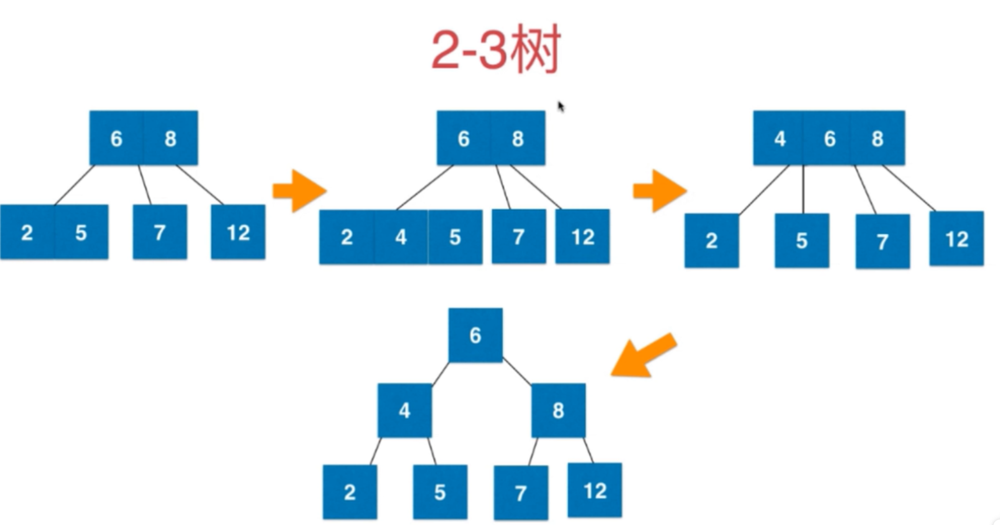
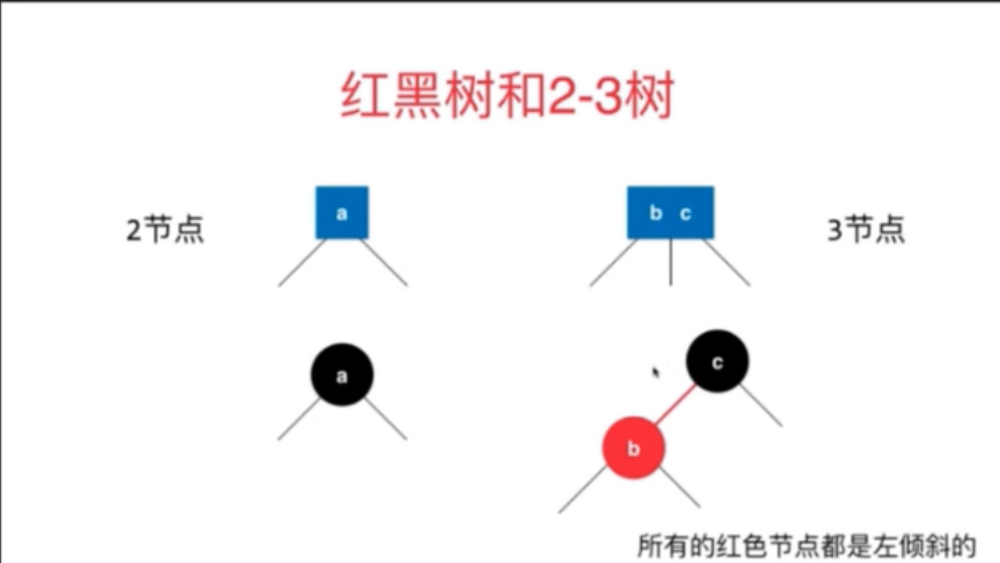
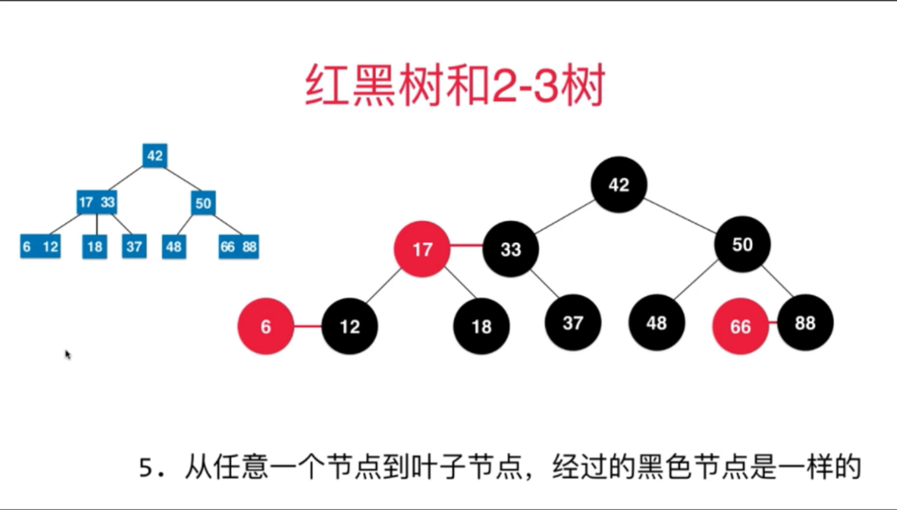

# 红黑树

## 2-3树

要理解红黑树，先要理解2-3树

2个元素的节点是 3节点，1个元素的节点是2节点

2-3树是一颗绝对平衡的树

2-3添加的时候，永远不会添加到空节点上去

## 红黑树和2-3树

2-3树里的3节点 转为 红黑节点，向左倾斜的是红节点

红黑树 是保持 黑平衡 的 二叉树

严格意义上，不是平衡二叉树   最大高度：2logn    O(logN)  

