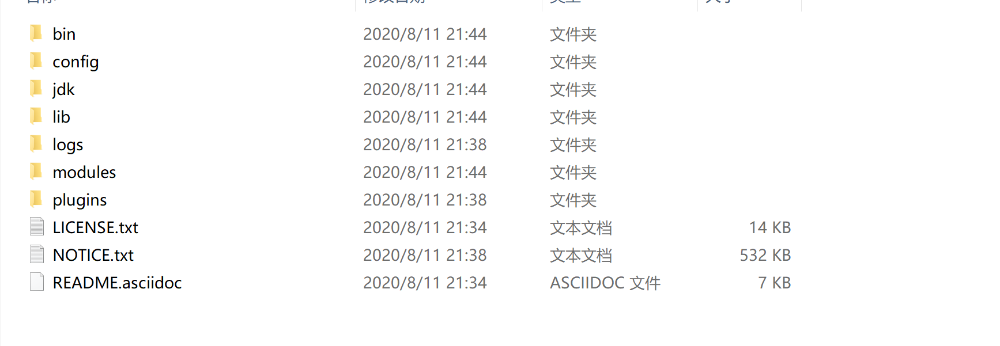
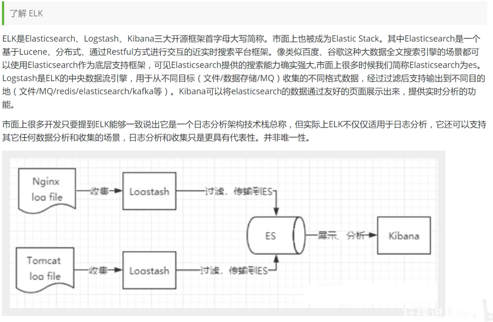
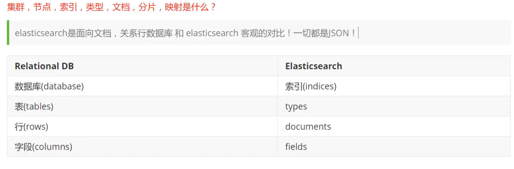
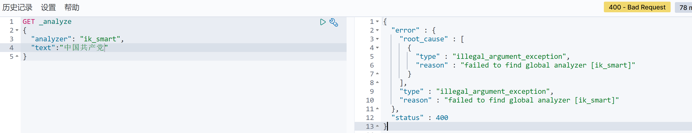
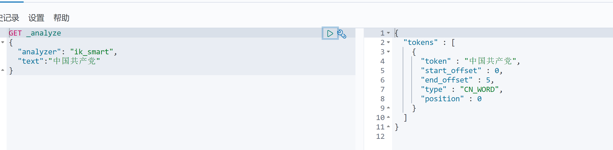
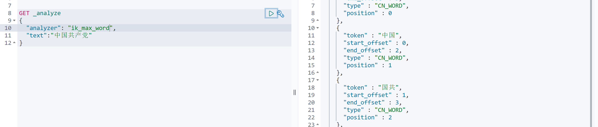
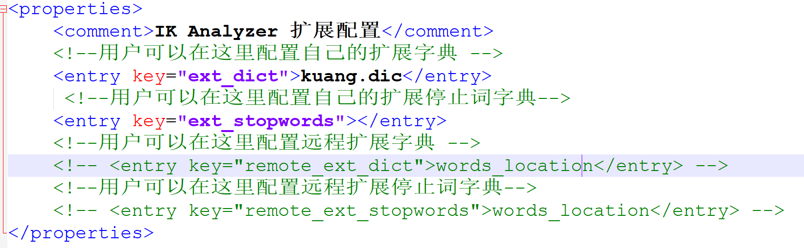
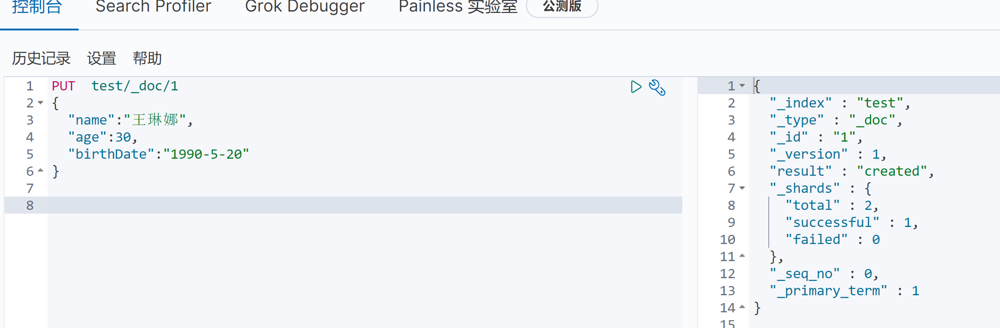
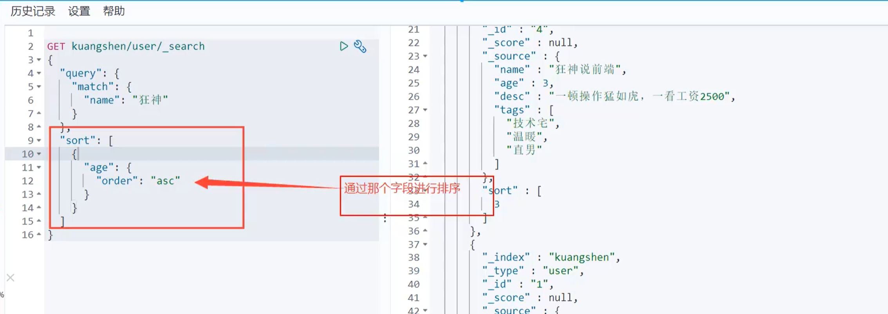
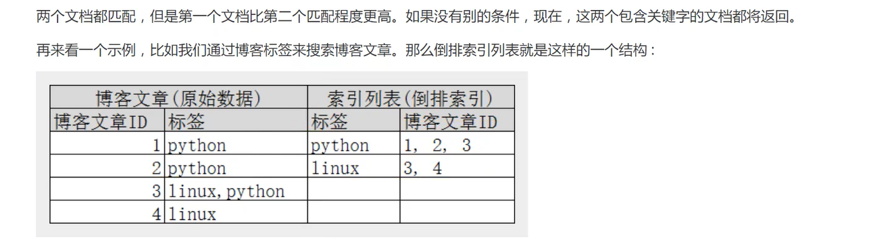

cnpm https://blog.csdn.net/wjnf012/article/details/80422313

SQL like %% 如果是大数据 速度十分慢 ！！ 索引

elasticsearch 搜索 百度 淘宝

聊一个人

货比三家

安装

生态圈

分词器 lk

# elasticsearch概述

以Lucence为核心

高扩展的分布式全文检索引擎，它可以近乎实时的存储，检索数据

通过简单的restful api 来隐藏Lucene 的复杂性

# elasticsearch和solr的差别

对已有数据进行搜索时，solr更快

当实时建立索引时，solr会产生io阻塞，es会更快

当数据量变大时，solr会变得很低

# elasticsearch安装

下载地址： https://www.elastic.co/cn/downloads/elasticsearch

目录分析



```
bin 启动文件

config 配置文件

	log4j2 日志配置文件
	jvm.options jvm配置文件 默认1g -Xms256m 改为256本机能运行
	elasticsearch.yml  elasticsearch的配置文件  默认9200端口！跨域
lib 相关jar包
modules 功能模块
plugin 插件  ik
logs 日志
	
```

启动 bin里的 elasticsearch.bat http://localhost:9200/ 能访问

## 可视化界面

下载地址 ：https://github.com/mobz/elasticsearch-head

前端项目 下载后进入 主目录执行以下

cnpm install

cnpm run start

访问9100发现有跨域问题

在es 的elasticsearch.yml 中添加跨域并重启es服务

http.cors.enabled: true

http.cors.allow-origin: "*"

初学es,可以把它当做一个数据库

可以把head当做一个数据展示工具

可以建立索引（库），文档（库中的数据)

## ELK



安装kibana

下载地址：https://www.elastic.co/cn/downloads/kibana

下载完毕 解压也需要一些时间，是个标准的工程

好处：基本上是拆箱即用的

在 bin目录下 点击bat文件 运行

进入config文件夹 kibana.yml 把配置文件改为

i18n.locale: "zh-CN" 进行汉化

# es核心概念



types在逐渐弃用

倒排索引

核心：

1.索引

2.字段类型（mapping）

3.文档（documents)

# IK分词器

分词 分成几个关键字

如果要使用中文，建议使用ik分词器

分为 ik_smart 和 ik_max_word 最小（没有重复） 和 最细（有重复）

下载地址：

https://github.com/medcl/elasticsearch-analysis-ik/releases

注意和 es版本保持一致

下载解压命名为 ik,放入 es的plugins 文件夹下

重启 es

可以通过 elasticsearch-plugin list 来查看加载进来的插件



当没装插件时为报错

装完插件后分词正常





## 关于自定义词库

D:\tools\elasticsearch-7.9.0\plugins\ik\config\IKAnalyzer.cfg.xml



同时在config目录下新疆 kuang.dic

可以换行建立多个单词，不过每次修改都要重启es

这个是kibana的界面

# REST风格说明



修改后版本号会增加

更新数据

PUT

POST /... /_update

GET /_search?q=name:狂神说

花式查询感觉可以查询文档



分页

参数是 from size

```
GET kuangshen/user/_search

{

"query":{

	"match":{

			"tag":"男 技术“

		}

	}

}	
```



倒排索引

terms查询是直接通过倒排索引指定的词条进程精确查找

关于分词：

 term 直接查询精确的

 match 会使用分词器解析（先分析文档，然后在通过分析的文档进行查询)

两个类型 text keyword

```
PUT testdb
{
  "mappings": {
    "properties": {
      "name":{
        "type":"text"
      },
      "desc":{
        "type": "keyword"
      }
    }
  }
}


PUT testdb/_doc/1
{
  "name":"狂神说java name",
  "desc":"狂神说java desc"

}

PUT testdb/_doc/2
{
  "name":"狂神说java name",
  "desc":"狂神说java desc2"

}

GET testdb/_search
{
  "query": {
    "term": {
      "name": "狂"
    }
  }
}

GET testdb/_search
{
  "query": {
    "term": {
      "desc": "狂"
    }
  }
}

GET testdb/_search
{
  "query": {
    "match": {
      "name": "狂"
    }
  },
    "highlight": {
        "pre_tag":"<p>",
        "post_tags":"</p>",
        "field": {
          "name": {}
        }
  }
}

keyword 字段类型不会被分词器解析
```

# 集成springboot

找文档 https://www.elastic.co/guide/en/elasticsearch/client/java-rest/current/java-rest-high-javadoc.html

要保持版本一致

```
<properties>
   <java.version>1.8</java.version>
   <!-- 自定义es版本-->
   <elasticsearch.version>7.9.0</elasticsearch.version>
</properties>

<dependencies>
   <dependency>
      <groupId>org.springframework.boot</groupId>
      <artifactId>spring-boot-starter-data-elasticsearch</artifactId>
   </dependency>
   <dependency>
      <groupId>org.springframework.boot</groupId>
      <artifactId>spring-boot-starter-web</artifactId>
   </dependency>
   <dependency>
      <groupId>org.springframework.boot</groupId>
      <artifactId>spring-boot-configuration-processor</artifactId>
   </dependency>

   <dependency>
      <groupId>org.springframework.boot</groupId>
      <artifactId>spring-boot-starter-test</artifactId>
      <scope>test</scope>
      <exclusions>
         <exclusion>
            <groupId>org.junit.vintage</groupId>
            <artifactId>junit-vintage-engine</artifactId>
         </exclusion>
      </exclusions>
   </dependency>
</dependencies>
```

https://gitee.com/zhengj2015/spring-es-api