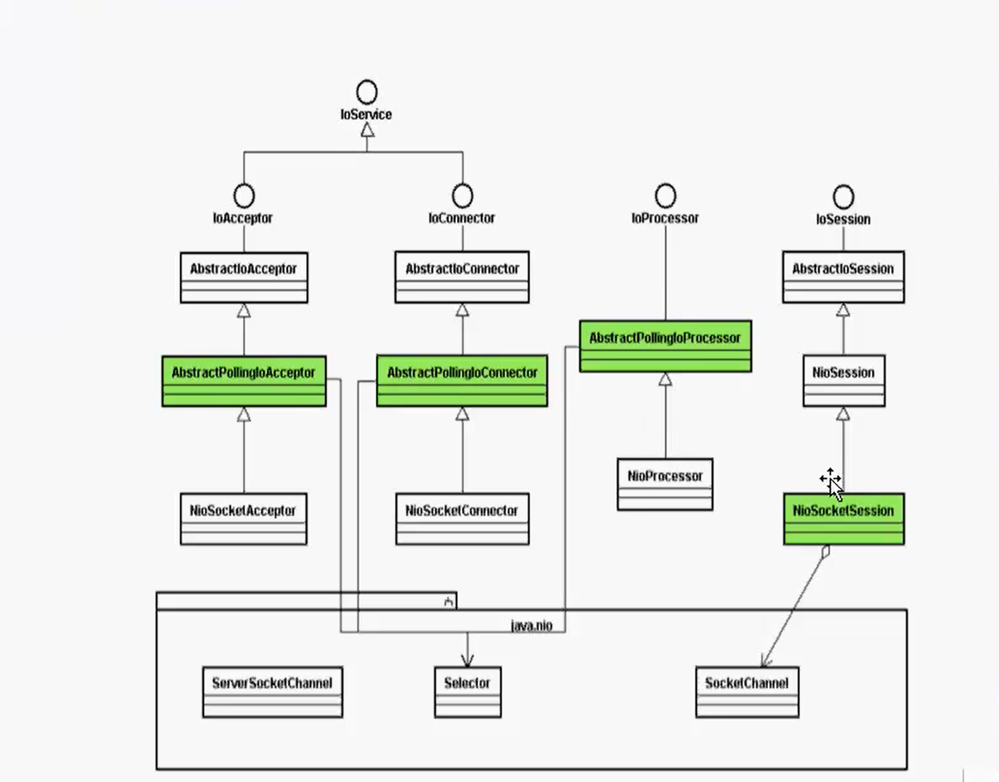

## 1.服务端入门demo

```xml
<?xml version="1.0" encoding="UTF-8"?>
<project xmlns="http://maven.apache.org/POM/4.0.0"
         xmlns:xsi="http://www.w3.org/2001/XMLSchema-instance"
         xsi:schemaLocation="http://maven.apache.org/POM/4.0.0 http://maven.apache.org/xsd/maven-4.0.0.xsd">
    <modelVersion>4.0.0</modelVersion>

    <groupId>org.zhengj</groupId>
    <artifactId>minaDemo</artifactId>
    <version>1.0-SNAPSHOT</version>

    <dependencies>
        <dependency>
            <groupId>org.apache.mina</groupId>
            <artifactId>mina-core</artifactId>
            <version>2.1.4</version>
        </dependency>
    </dependencies>

</project>
```

```java
package com.mina;

import org.apache.mina.core.service.IoAcceptor;
import org.apache.mina.core.session.IdleStatus;
import org.apache.mina.filter.codec.ProtocolCodecFilter;
import org.apache.mina.filter.codec.textline.LineDelimiter;
import org.apache.mina.filter.codec.textline.TextLineCodecFactory;
import org.apache.mina.transport.socket.nio.NioSocketAcceptor;

import java.net.InetSocketAddress;
import java.nio.charset.Charset;

public class MinaServer {

    static int PORT = 7080;
    static IoAcceptor accept = null;

    public static void main(String[] args) {
        try {
            accept = new NioSocketAcceptor();
            //设置编码过滤器
            accept.getFilterChain().addLast("codec",new ProtocolCodecFilter(
                    new TextLineCodecFactory(
                            Charset.forName("UTF-8"), LineDelimiter.WINDOWS.getValue(),
                            LineDelimiter.WINDOWS.getValue()
                    )
            ));
            accept.getSessionConfig().setReadBufferSize(1024);
            accept.getSessionConfig().setIdleTime(IdleStatus.BOTH_IDLE,10);
            accept.setHandler(new MyServerHandler());
            accept.bind(new InetSocketAddress(PORT));
            System.out.println("Server ->" +PORT);
        } catch (Exception e) {
            e.printStackTrace();
        }

    }
}
```

```java
package com.mina;

import org.apache.mina.core.service.IoHandlerAdapter;
import org.apache.mina.core.session.IdleStatus;
import org.apache.mina.core.session.IoSession;

import java.util.Date;

public class MyServerHandler extends IoHandlerAdapter {

    @Override
    public void sessionCreated(IoSession session) throws Exception {
        System.out.println("sessionCreated");
    }

    @Override
    public void sessionOpened(IoSession session) throws Exception {
        System.out.println("sessionOpened");
    }

    @Override
    public void sessionClosed(IoSession session) throws Exception {
        System.out.println("sessionClosed");
    }

    @Override
    public void sessionIdle(IoSession session, IdleStatus status) throws Exception {
        System.out.println("sessionIdle");
    }

    @Override
    public void exceptionCaught(IoSession session, Throwable cause) throws Exception {
        System.out.println("exceptionCaught");
    }

    @Override
    public void messageReceived(IoSession session, Object message) throws Exception {
        String msg = (String)message;
        System.out.println("服务端接收到的数据:"+msg);
        Date date = new Date();
        if("exit".equals(msg)) {
            session.closeNow();
        }
        session.write(date);
    }

    @Override
    public void messageSent(IoSession session, Object message) throws Exception {
        System.out.println("messageSent");
    }
}
```

小结： 1.NIOSocket

​			2.设置编码解码过滤器

​			3.设置一些session属性

​			4.绑定一个端口

​			测试时 用 cmd  telnet 127.0.0.1 7080 来测试，直接打字就能看到后台

​	

## 2.mina客户端

主要实现上次课程的client,其实mina的服务端和客户端的程序很相似

```java
package com.mina;

import org.apache.mina.core.future.ConnectFuture;
import org.apache.mina.core.service.IoConnector;
import org.apache.mina.core.session.IoSession;
import org.apache.mina.filter.codec.ProtocolCodecFilter;
import org.apache.mina.filter.codec.textline.LineDelimiter;
import org.apache.mina.filter.codec.textline.TextLineCodecFactory;
import org.apache.mina.transport.socket.nio.NioSocketConnector;

import java.net.InetSocketAddress;
import java.nio.charset.Charset;

public class MinaClient {

    private static String host = "127.0.0.1";
    private static int port = 7080;

    public static void main(String[] args) {
        IoSession session = null;
        IoConnector connector  = new NioSocketConnector();
        connector.setConnectTimeoutMillis(3000);
        //设置过滤器
        connector.getFilterChain().addLast(
                "coderc",
                new ProtocolCodecFilter(
                        new TextLineCodecFactory(Charset.forName("UTF-8"),
                        LineDelimiter.WINDOWS.getValue(),
                        LineDelimiter.WINDOWS.getValue())));
        connector.setHandler(new MyClientHandler());
        ConnectFuture future = connector.connect(new InetSocketAddress(host,port));
        future.awaitUninterruptibly();//等待我们的连接
        session=future.getSession();
        session.write("你好！watchmen");
        session.getCloseFuture().awaitUninterruptibly();//等待关闭连接
        connector.dispose();
    }
}
```

```java
package com.mina;

import org.apache.mina.core.service.IoHandlerAdapter;
import org.apache.mina.core.session.IoSession;

public class MyClientHandler extends IoHandlerAdapter {
    @Override
    public void exceptionCaught(IoSession session, Throwable cause) throws Exception {
        System.out.println("exceptionCaught");
    }

    @Override
    public void messageReceived(IoSession session, Object message) throws Exception {
        String msg = (String)message;
        System.out.println("客户端收到数据:"+msg);
    }
}
```

## 3.mina整体架构

1.mina在应用程序中处于什么样的地位

​		主要屏蔽了网络通信的一些细节，对socket进行封装，并且是NIO的一个

实现架构，可以帮助我们快速的开发网络通信，常常用于游戏的开发，中间件等服务 


2.IOService接口

用于描述我们的客户端和服务端接口，

其子类是connector和Acceptor,分别用于描述我们的客户端和服务端。

IOprocesser多线程环境来处理我们的连接请求流程，

ioFilter提供数据的过滤工作，包括编解码，日志等信息的过滤，

Hanlder就是我们的业务对象，自定义的handler需要实现IOHandlerAcceptor


3.大致看看类图结果



Iosession：描述的是客户端和服务端连接的描述，常常用于接受和发送数据


## 4.mina学习之长短连接

像qq这种就是长连接，比较消耗IO资源

http协议，客户端发起http请求，服务器处理，是常见的短连接

想起到面试题，http怎么实现长连接  ，应该是keep-alive


改造mina的长连接为短连接， 注释掉

 if("exit".equals(msg)) {
            session.closeNow();
        }  

在messageSent 下写 session.closeNow();

