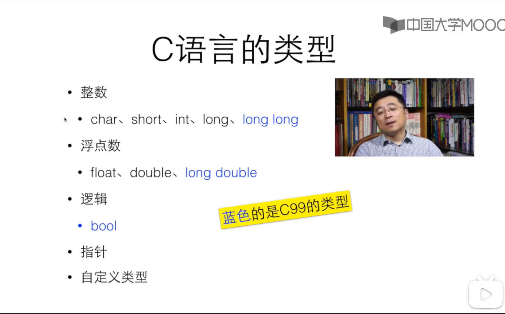
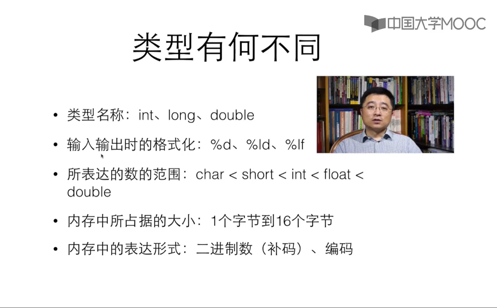
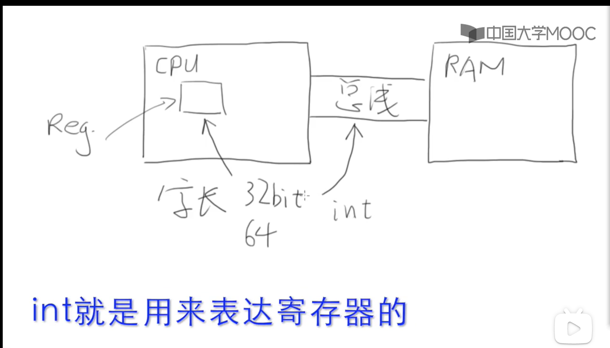
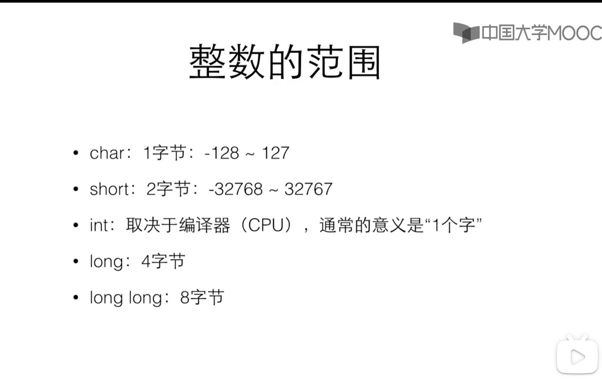
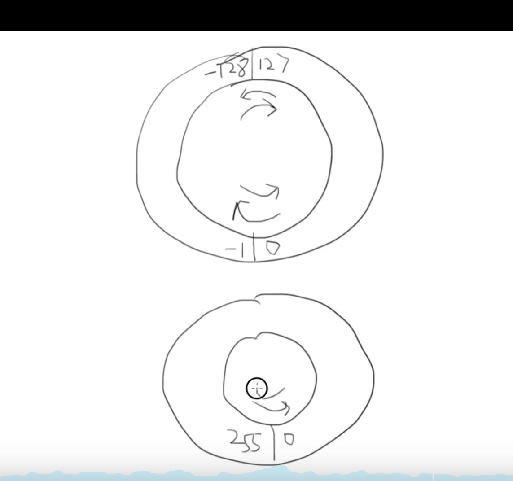
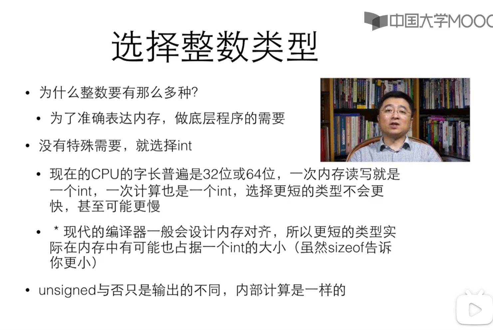
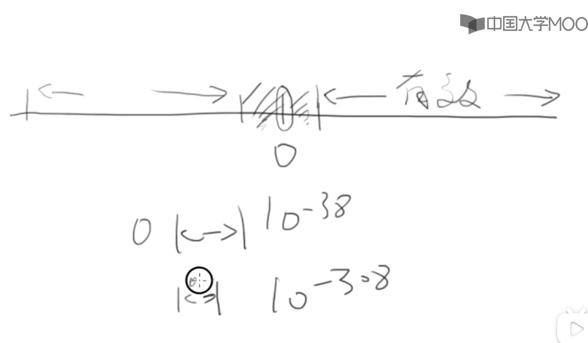
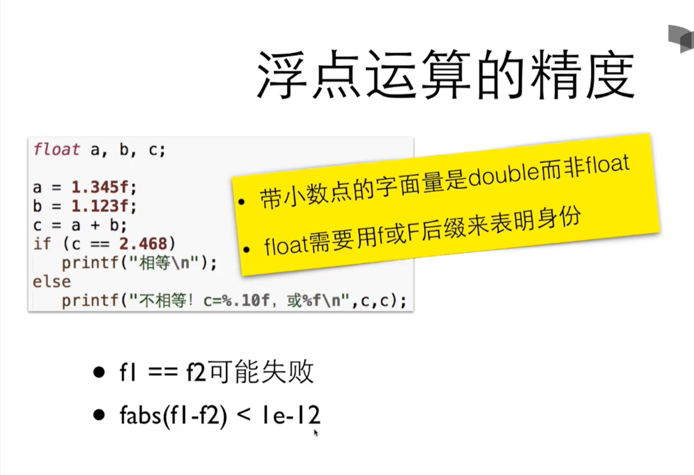
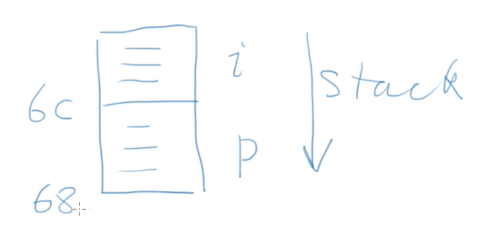
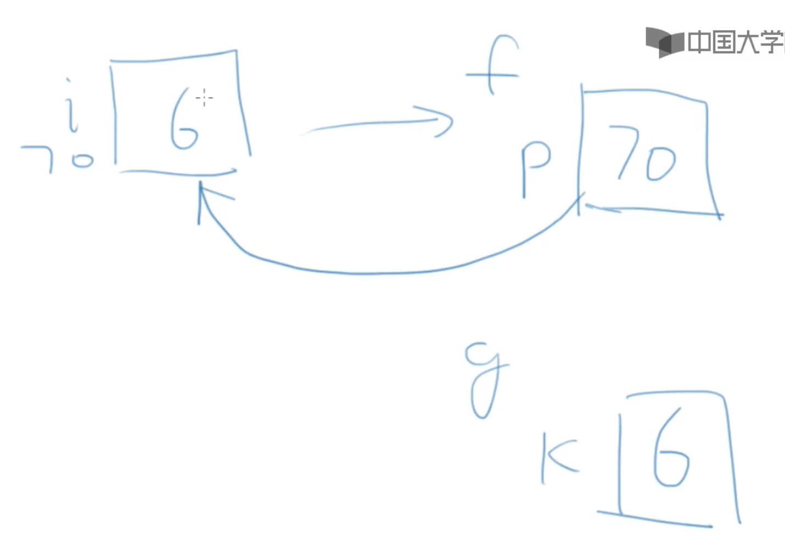

# c语言简介

解释型和编译型不是绝对的，计算机语言本身并没有解释和编译之分

python也有人写编译器，c也有人做了解释器

只是传同上认为c是编译型语言，python是解释性语言


1989 ANSI 发不了 "ANSI C"，或有时称为"C89"（为了区别C99）。

c标准在95年和99年两次更新 C95和C99

所有当代编译器都支持$\textcolor{Red}{C99} $了


区别小计：

1.ansi c 只能在代码开头定义变量,c99 不限制

2.c99最好定义常量的方式    const int AMOUNT = 100;   

不定义的话，我们称100这种莫名其妙的数字为magic number

 


# 开发工具

dev c++ 5.6.4  可以写c++ (不用建工程)

sublime text 和MinGw一起使用 （Minniset Gnu for windows   gcc）

...

国际惯例：hello world

```c
#include <stdio.h>

int main()
{
	printf("Hello world\n");
    printf("12+23=%d\n",12+23);
	return 0;
}


```

unix中 可以用 gcc hello.c 来编译 如若不指定，则生成a.out 文件

gcc hello.c -o hello    ./hello

./a.out  则会执行   ./是unix为了安全的手段，保证当前目录和系统重名的文件不会被执行

# 变量

```c
//当变量不初始化，就运算可能得到很奇怪的内容
//因为不打扫就进入，就看上家的人品了
int main()
{	
	int i;
	int j;
	j = i+10;
	printf("%d\n",j);
    //读取
    int price = 0;
    printf("请输入金额(元)");
    scanf("%d",&price);
    printf("您输入了%d元",price);
	return 0;
}

//当输入了英文hello
//输出了0
```

```c
#include <stdio.h>

int main()
{	
	int a;
	int b;
	printf("请输入两个数");
	scanf("%d %d",&a,&b);
	printf("%d+%d=%d",a,b,a+b);
	return 0;
}
```

## 浮点数

c语言中两个整数的运算结果只能是整数

10/3*3 => 是整数 

printf("%f\n",10.0/3); 

当整数和浮点数一起运算时，c语言会把整数变成浮点数再参与运算


## 递增递减

```c
int main()
{
	int a;
	a = 10;
	printf("a++=%d\n",a++);
	printf("a=%d\n",a);

	printf("++a=%d\n",++a);
	printf("a=%d\n",a);

} 
```


0长得像cita是因为电报，和o区分开来


# 数据类型

p61--68






sizeof 能看出类型 在内存中占据几个字节


```c
int main()
{
	int a;
	a = 10;
	printf("sizeof(int)=%ld\n",sizeof(int));
	printf("sizeof(a)=%ld\n",sizeof(a));
	printf("sizeof(double)=%ld\n",sizeof(double));
	printf("sizeof(double)=%ld\n",sizeof(long double));
	printf("sizeof(a)=%ld\n",sizeof(a++));
	

	printf("a=%d\n",a);
	
	return 0;
}
```

上面的例子发现 a 打印的值还是 10， 说明 sizeof是静态编译后定的


sizeof  后整数发现

char:1字节(8比特)

short:2字节

int:取决于编译器(CPU),通常的意义是“1个字"

long:取决于编译器(CPU),通常的意义是"1个字"

long long：8字节


字长的意思就是寄存器是多少宽的  reg是寄存器  ram内存

!(image-20210418000536518.png)



寄存器上一次能处理的数据是32bit,总线一次能传输的数据是32bit  所以是字长

不同的平台不同的CPU 字长是不同的

一个int表达的是一个寄存器的大小

比int小的可能表达是几个位，比int大的可能是几个寄存器拼起来的


补码的意义是待溢出和原来相加有个待溢出的数


```c
#include <stdio.h>

int main()
{
	char c = 255;
	int i = 255;
	printf("c=%d,i=%d\n",c,i);
	//11111111
	//00000000 00000000 00000000 11111111
	return 0;
} 

//为什么c是-1，原因就是最高位当成补码
```



如果希望不用补码，即没有负数，就可以用unsigned 来表示

```c
int main()
{
	unsigned char c = 255;
	int i = 255;
	printf("c=%d,i=%d\n",c,i);
    
    char c1 = -128;
    c1 = c1 -1
	printf("c1=%d,i=%d\n",c1,i);
	return 0;
} 


```





```c
int main()
{
	int a=0,b=0;
	while(++a>0)
	;
	printf("int表达的最大值是%d\n",a-1);

	b++;
	while((a=a/10)!=0) 
	{
		b++;
	}
	printf("int数据类型最大的数的数位是:%d",b);
	return 0;

} 
```

## 如何选择整数类型




double和float的区别是   double精度更准一些

他们的范围是 double 2.2*10-308   float 1.2*10-38

靠近0的中间有很小一段是没法表达的 如下图




printf("%.3f\n",b);   //保留三位小数




如果没有特殊需求，选择doble 就好，现在的cpu能直接对double做硬件运算

char是一种整数，也是一种特殊的类型：字符，  用单引号的字符面：'a','1'

用字符时用 c, 输出数字时用 d

当运算时， char -> int ->float ->double   会自动转换为范围更大的

printf 对于任何小于int 的类型会被转换成int,float会被转换成 double

但是scanf不会，要输入short,需要%hd

强制类型转换    (int)3249 ， 但注意要安全隐患


# 函数

c语言中 函数需要先声明再调用，

因此要先在前面声明下   也可以直接写在顶部

类型不匹配 ： 

​	调用函数类型与参数类型可以不匹配，编译器悄悄把你转好，这是最大的漏洞

​	后续的C++/Java 在这方面很严格


```c
#include <stdio.h>

void swap(int a,int b);

int main()
{
	int a = 3;
	int b = 5;
	
	swap(a,b);
	
	printf("a=%d b=%d\n",a,b);
	
	return 0;

} 

void swap(int a,int b) 
{
	int t = b;
	b = a;
	a = t;
}

//说明c语言在函数传递中是值传递
```

void f(void)  不传任何参数

void f() 在传统c中，表示参数未知，并不表示没有参数


# 数组

```c
#include <stdio.h>

//0 - 9每个数的出现次数
int main()
{
	const int number = 10;
	int x;
	int count[number];
	int i;
	

	for(i=0;i<number;i++) {
		count[i] = 0;
	}
	scanf("%d",&x);
	while(x!=-1) {
		if(x>=0 && x<=9) {
			count[x]++;
		}
		scanf("%d",&x);
	}
	
	for(i=0;i<number;i++) {
		printf("%d:%d\n",i,count[i]);
	}
	return 0;

} 
```


# 指针

```c
int main()
{
 	int i = 0;
 	int p;
 	p = (int)&i;
 	printf("0x%x\n",p);
 	printf("%p\n",&i);
 	printf("%lu\n",sizeof(int));
 	printf("%lu\n",sizeof(&i));

	return 0;

} 
//地址和整数并不永远相同，和架构是有关的
```

```c
int main()
{
 	int i = 0;
 	int p;
 	printf("%p\n",&i);
 	printf("%p\n",&p);
	return 0;
} 
//相差了4位 刚好是sizeof(int) 并且先定义的在上面

```



```c
int* p,q 

int *p,q  

意思是*p是 int,if want to q is point;
int* p,*q;
```

```c


#include <stdio.h>

void f(int *p);
void g(int k);

int main(void)
{
 	int i = 6;
 	printf("&i=%p\n",&i);
 	f(&i);
 	g(i);
 	

	return 0;

} 

void f(int *p)
{
	printf("p=%p\n",p);
	printf("*p=%d\n",*p);
	*p=26; //改变了*p 所指向
}

void g(int k)
{
	printf("k=%d\n",k);
}
*p是值，不是变量 在左边叫左值，右边是右值
```




下图 是上边代码的解释， p存贮了i的地址

当scanf 不写 &时 编译不报错，是因为scanf认为传进来的数字就是地址，运行报错是因为传进来的地址太小了

那个地方存储了很重要的东西


#include <stdio.h>

int main(void)补
{ub
	char ac[] = {1,2,3,4,5,6,7,};
	char *p = ac;
	printf("p = %p\n",p);
	printf("p+1 = %p\n",p+1);
	int ai[] = {1,2,3,4,5,6,7,};
	int *q = ai;
	int *q1 = &ai[5];
	printf("q = %p\n",q);
	printf("q+1 = %p\n",q+1);
	printf("q1-q = %d\n",q1 - q); //得到的是 a[5]/sizeof(int)
	return 0;
} 

#遍历数组的两种方法

```c
#include <stdio.h>

int main(void)
{
	int ai[] = {1,2,3,4,5,6,7,-1};
	int i;
	for(i=0; i<sizeof(ai)/sizeof(ai[0]); i++) {
		printf("%d\n",ai[i]);
	}
	int *p = ai;
	while(*p!=-1) {
		printf("%d\n",*p++);
	}
	return 0;
	
} 
```

0地址 通常是不能随便碰的地址

NULL是一个预定义的符号，表示0地址


```c
#include <stdio.h>
#include <stdlib.h>

int main(void)
{
	int number;
	int *a;
	int i;
	printf("输入数量");
	scanf("%d",&number);
	//int a[number]
	a = (int*)malloc(number*sizeof(int));
	for(i=0; i<number; i++) {
		scanf("%d",&a[i]);
	} 
	for(i=number-1; i>=0; i--) {
		printf("%d ",a[i]);
	}
	free(a); //释放申请的内存空间 
 	return 0;
} 
```


分配了空间

```c
#include <stdio.h>
#include <stdlib.h>

int main(void)
{
	void *p;
	int cnt = 0;
	while( (p=malloc(100*1024*1024))) {
		cnt++;
	}
	printf("分配了%dM空间\n",cnt);
 	return 0;
} 
```


```java
/**
 * 简易对答程序Server
 * 
 */
import java.io.BufferedReader;
import java.io.IOException;
import java.io.InputStreamReader;
import java.io.PrintWriter;
import java.net.ServerSocket;
import java.net.Socket;

public class TalkSever {
	public static void main(String[] args) {
		try {
			ServerSocket server = null;
			try {
				server = new ServerSocket(4700);
			} catch (IOException e) {
				// TODO Auto-generated catch block
				e.printStackTrace();
				System.out.println("can not listen:" + e);
			}
			Socket socket = null;

			try {
				socket = server.accept();
			} catch (IOException e) {
				// TODO Auto-generated catch block
				e.printStackTrace();
				System.out.println("Error:" + e);
			}
	
			String line;
			// 缓冲区
			BufferedReader is = new BufferedReader(new 			    InputStreamReader(socket.getInputStream()));
			PrintWriter os = new PrintWriter(socket.getOutputStream());
			BufferedReader sin = new BufferedReader(new InputStreamReader(System.in));
			// 如果客户端没有输入，这个方法就阻塞了
			System.out.println("client:" + is.readLine());
			line = sin.readLine();
			// 这个循环表明客户端和服务端必须一人说一句
			while (!"bye".equals(line)) {
				// 把服务端键盘的输入写到客户端去
				os.println(line);
				os.flush();
				System.out.println("sever:" + line);
				System.out.println("Client:" + is.readLine());
				line = sin.readLine();
			}
			is.close();
			os.close();
			socket.close();
		} catch (IOException ex) {
			// TODO Auto-generated catch block
			ex.printStackTrace();
			System.out.println("Errorex:" + ex);
		}
	}

}


```


```java
/**
 * 简易对答程序Client
 * 
 */
import java.io.BufferedReader;
import java.io.IOException;
import java.io.InputStreamReader;
import java.io.PrintWriter;
import java.net.Socket;

public class TalkClient {
	public static void main(String[] args) {
		try {
			Socket socket = new Socket("127.0.0.1", 4700);
			BufferedReader sin = new BufferedReader(new InputStreamReader(System.in));
			PrintWriter os = new PrintWriter(socket.getOutputStream());
			BufferedReader is = new BufferedReader(new InputStreamReader(socket.getInputStream()));
			String readLine;
			readLine = sin.readLine();
			while (!"bye".equals(readLine)) {
				// 把客户端键盘的输入写到服务端去
				os.println(readLine);
				os.flush();
				System.out.println("Client:" + readLine);
				System.out.println("Server:" + is.readLine());
				readLine = sin.readLine();
			}
			is.close();
			os.close();
			socket.close();
		} catch (IOException ex) {
			// TODO Auto-generated catch block
			ex.printStackTrace();
			System.out.println("Errorex:" + ex);
		}
	}
}
```

