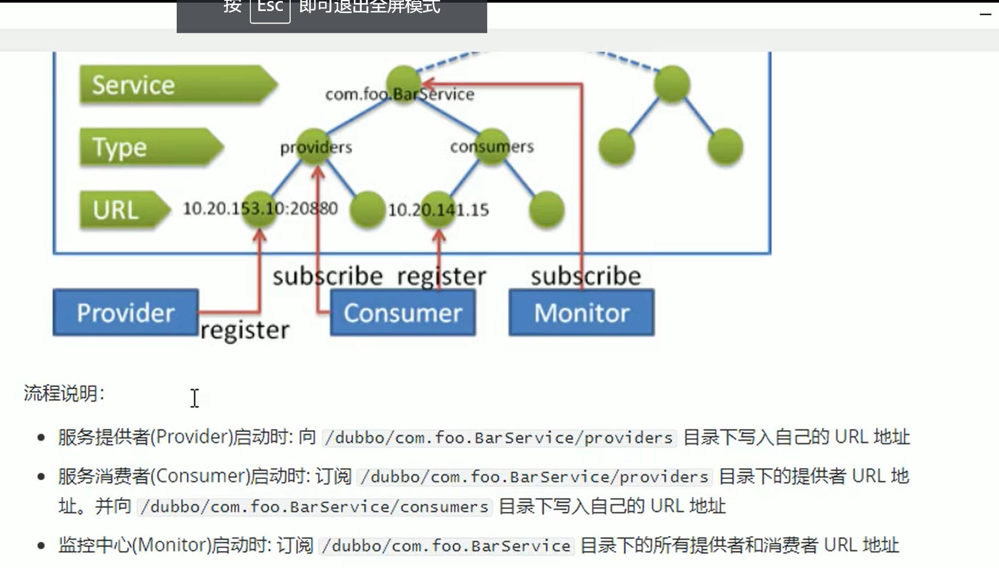
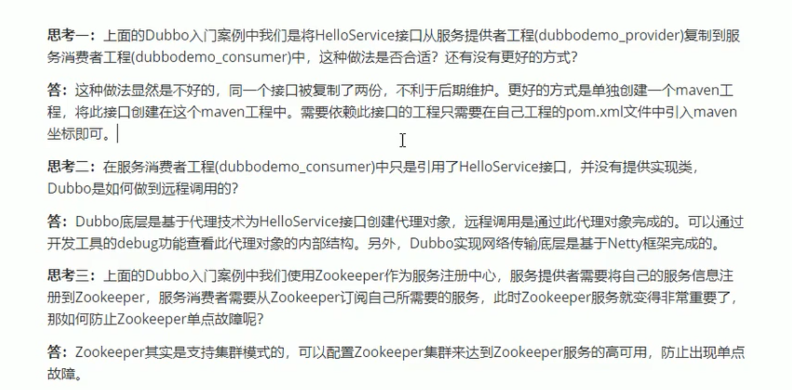

# maven

## maven的继承

在parent的模块里 打包为pom

```
<packaging>pom</packaging>
```

## maven的聚合

在parent的模块里 

```
<modules>
    <module>hzfi-firm-common</module>
</modules>
```

Maven的中央仓库地址默认是：https://repo.maven.apache.org/maven2/,

地址详解:https://www.cnblogs.com/molashaonian/p/7242010.html

nexus下载详解:https://blog.csdn.net/lk142500/article/details/95869196

下载后的启动:https://www.cnblogs.com/wcrBlog/p/12273371.html

我是翻墙下载的

不知道为什么 windows下 nexus没反应啊

在centos上安装  要先安装java 和 maven  java-v  mvn -v

详细教程如下：

https://blog.csdn.net/lazycheerup/article/details/85255799

wget连不上 只好去官网下载 unix版本

执行这个命令后 才能访问虚拟机里的端口

service iptables stop  https://blog.csdn.net/qq_39390545/article/details/102805959

初始密码不是 admin123 需要根据提示去查找

hosted是 宿主的意思

release是内部发布版本

snapshorts 是内部测试版本

搞了半天还是没往私服上上传，

下载 一般是先去本地仓库找，没有再在私服找，最后去公共仓库找

https://www.cnblogs.com/kevingrace/p/6201984.html


# 软件架构

架构演进：

单体架构->垂直架构->SOA架构->微服务架构

**单体架构** 有点：前期开发周期短，成本低，适合小项目

缺点：对于大项目不易开发，拓展和维护

技术栈受限:只能用一种语言开发

系统性能扩展 只能通过集群，成本高


**垂直架构**

说明：根据业务进行切割，形成小的单体项目

优点：技术栈可扩展

缺点：功能集中在一个项目中，不利于开发，扩展和维护

​		   系统扩展只能通过集群的方式

​		  项目之间功能冗余，数据冗余，代码耦合性强


**SOA架构**

说明：将重复功能或模块抽取组件的形式，对外提供服务，在项目与服务之间使用ESB(企业服务总线)

的形式作为通信的桥梁

优点: 重复功能或模块抽取为服务，提高开发效率

​		  可重用性高

​           可维护性高

缺点：各服务之间业务不同，很难确定功能或模块是重复的

​			抽取服务的粒度大

​			系统和服务之间耦合性强


**微服务**

将系统服务层完全独立出来，抽取为一个个的微服务

抽取的粒度更小，遵循单一原则

采用轻量级协议传输

优点: 粒度小，开发效率高

​		可以针对不同服务指定对应的优化方案

​		使用于互联网时代，产品迭代周期更短

缺点：粒度小服务多，维护成本高

​			分布式系统技术成本高


**Dubbo**

RPC 框架，RPC是远程过程调用

Dubbo三大核心:面向接口的远程方法调用,智能容错和负载均衡，以及服务自动发现和注册

自己思考  RPC和 http区别

- 速度来看，RPC要比http更快，虽然底层都是TCP，但是http协议的信息往往比较臃肿
- 难度来看，RPC实现较为复杂，http相对比较简单
- 灵活性来看，http更胜一筹，因为它不关心实现细节，跨平台、跨语言。

因此，两者都有不同的使用场景：

- 如果对效率要求更高，并且开发过程使用统一的技术栈，那么用RPC还是不错的。
- 如果需要更加灵活，跨语言、跨平台，显然http更合适


## dubbo架构


Registry注册中心

Consumer服务消费方

Provider 服务提供方

Monitor监控层：RPC调用次数和调用时间监控

container:服务运行容器


## **Zookeeper**

dubbo官方推荐的服务注册中心

zookeeper是树形结构的




### 下载好后解压

tar -zxvf appp.tar -C /usr/local   指定目录

进入 zookeeper目录 新建 data目录

进入config 目录

把 zoo_sample.cfg  改为zoo.cfg

可以用复制 cp zoo_ss.cfg zoo.cfg

进入 zoo.cfg  把 改为dataDir = /usr/local/apache-zookeeper-3.6.2-bin/data

### 启动和运行

启动:  ./zkServer.sh start

停止: ./zkServer.sh stop

查看运行状态:   ./zkServer.sh status

## Dubbo快速入门

### dubbo入门例子

https://gitee.com/zhengj2015/dubbodemo-cousmer

### dubbo思考题



### dubbo相关配置

##### 1.包扫描

```xml
<dubbo:application name="dubbodemo_provider"></dubbo:application>
```

如果不使用包扫描，也可以通知如下配置的方式来发布服务

```xml
<bean id="helloservice" class="com.it.service.impl.HelloServiceImpl" />
<dubbo:service interface="com.it.api.HelloService" ref="helloSerice" />
```

作为消费者，可以通过如下配置来引用服务

```xml
<dubbo:refernce id="helloService" interface="com.it.api.HelloService" />
```

这种方式比较繁琐，推荐包扫描

##### 2.协议

```xml
<dubbo:protocol name="dubbo" port="20880"></dubbo:protocol>
```

其中Dubbo支持的协议有：dubbo,rmi,hesslan,webservice,rest,redis等

也可以用注解

@Service(protocol="dubbo")

##### 3.检查

```xml
<dubbo:consumer check="true"></dubbo:consumer>
```

true会报错

这个检查一般用于消费方，建议开发环境设置为false,生产设置为true

##### 4.负载均衡

负载均衡Dubbo提供了多种均衡策略(包括随机，轮询(RoundRobin)，最少活跃调用数,一致性Hash)

缺少为Random

**@Service(loadbalance="random")**


### Dubbo无法发布被事务代理的Service问题

例子中扫描到@Service注解的类就可以发布为服务

但是我们如果在服务提供者类上加上@Transactional 事务控制注解后，服务就发布不成功了，原因是

事务控制的底层原理是为服务提供者创建代理对象，而默认情况Spring是基于JDK动态代理创建对象，

而此代理名为com.sun.proxy.$Proxy42(最后两位数字不是固定的)，导致Dubbo在发布服务前进行包匹配

时无法完成匹配，进而没有进行服务的发布


解决方法:

```xml
<!-- 以 @Transactional 标注来定义事务  -->
<tx:annotation-driven transaction-manager="transactionManager" proxy-target-class="true"/>
```

```
@Service(interfaceClass = HelloService.class)
```

第一步是把 代理方式改为 cglib

第二步是因为代理对象名为会改，现在固定一下

springboot

`spring.aop.proxy-target-class=true`或

@EnableAspectJAutoProxy(proxyTargetClass = true`)